### Machine Name: Conversor
### Difficulty: Easy
### Points: 20
### OS: Linux 

### [*] Scanning
- Start Nmap scanning to identify the target.
- SSH opened and HTTP server `http://conversor.htb/`
- Put the target in `/etc/hosts` file to access the target website.
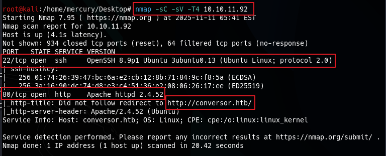
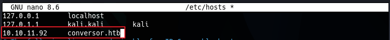
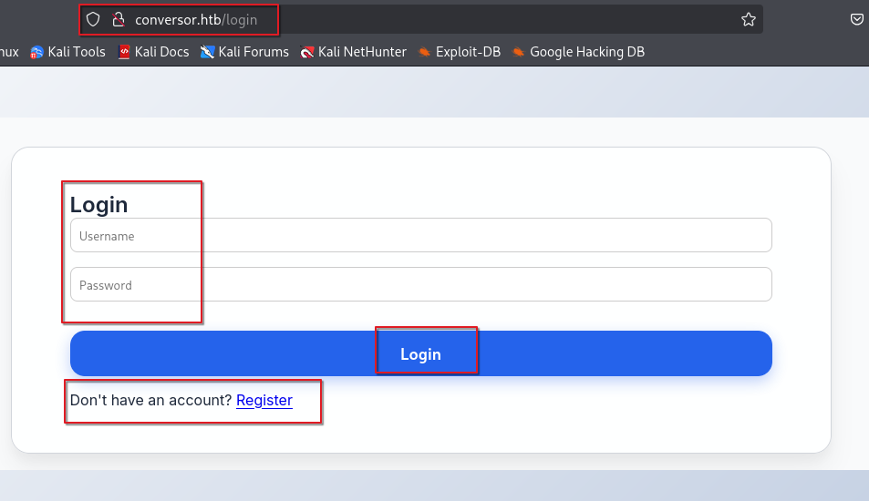
- I registered an account to login to the website and test it's functionalities.
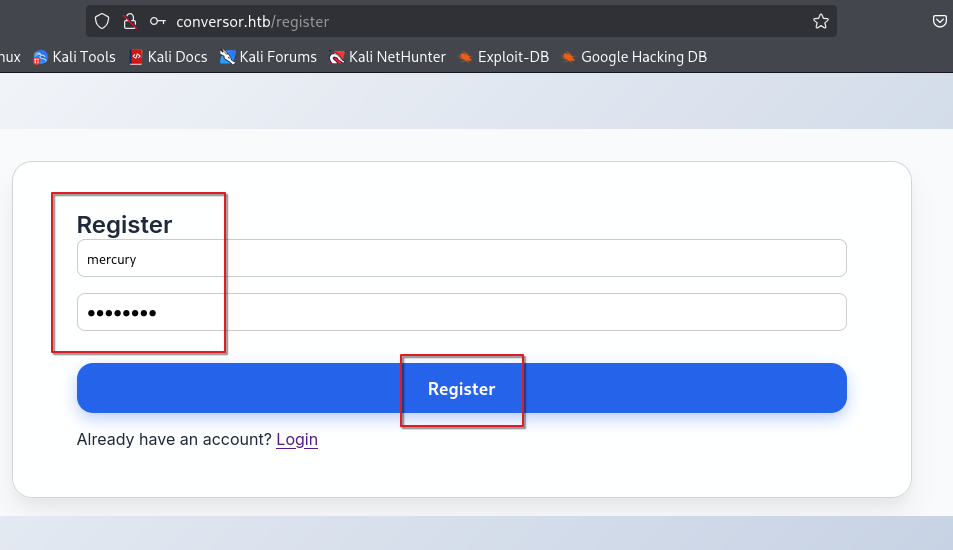
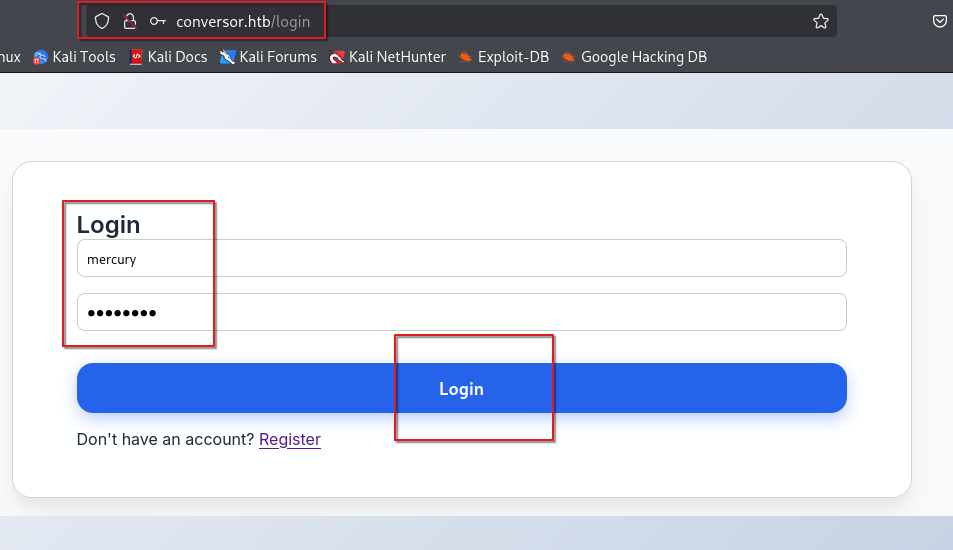

### [*] Website Enumeration
- I tried to enumerate the files and directories and subdomains but i got nothing.
- So all i got is main domain `conversor.htb`, I decided to test it's functionalities.

### [*] RCE (Remote Command Execution) Via File Upload
- The website provide you to upload XML and XSLT files.
- The webserver takes these files and executes it to render the data on html page.
- Website gives you template of the files to know how to make it.
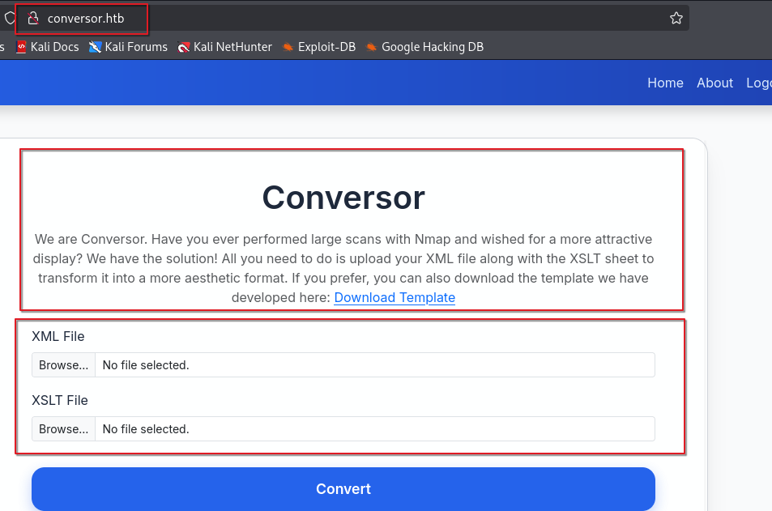
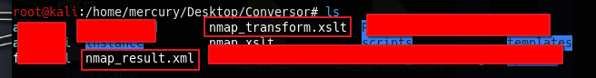
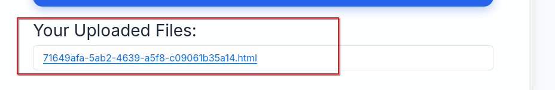
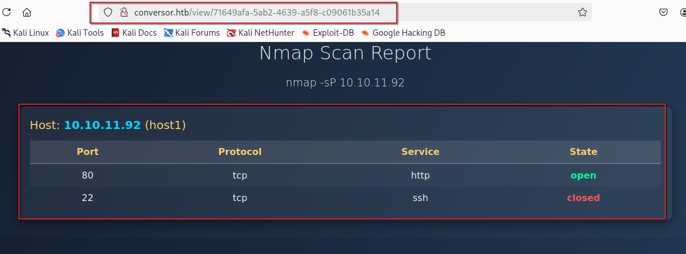
- After some research i found something called `XSLT injection`, This vulnerability makes attacker to inject reverse shell payload in XSLT file and once you request the rendered HTML file, You'll receive reverse shell on you listener.
- I took the exploit files in this link https://github.com/ex-cal1bur/XSLT-Injection_reverse-shell
- Put my listener IP and PORT inside the XSLT file.
- Get my listener ready on the same port in XSLT file.
- Upload the files on the website.
- Once you requested the html markup of the injected file, You'll get reverse shell.
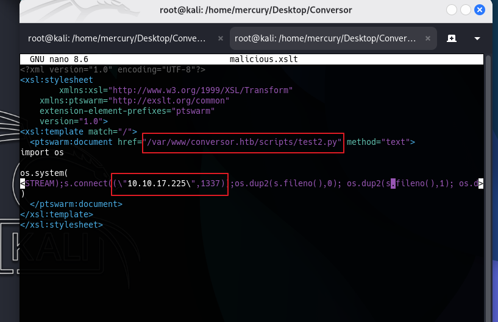
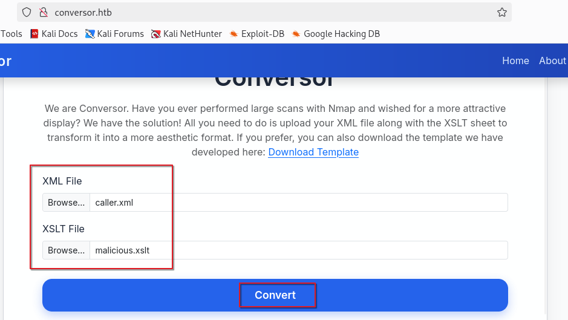
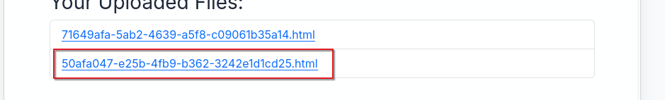
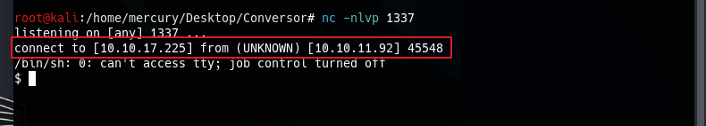

### [*] Privilege Escalation To User Flag
- I identified the users on the system.
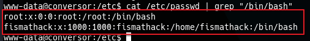
- I uploaded linpeas script to get user with higher permissions, And i found database file called `users.db` and i found credintials of some users, And credintials of `fismathack` user.
- I logged in this user with SSH and got `user.txt` file (User Flag)
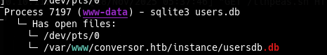
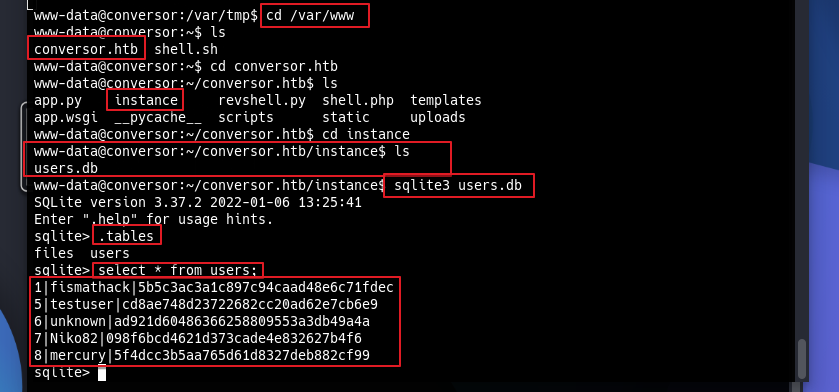
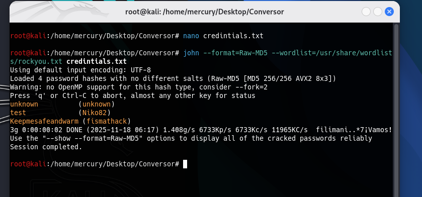
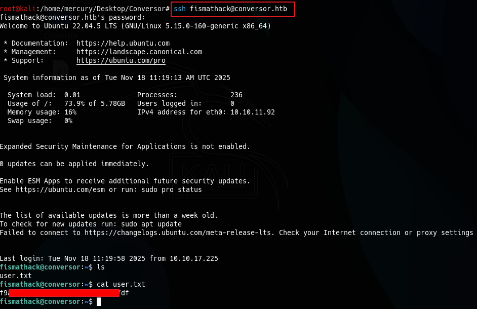

### [*] Privilege Escalation To Root Flag
- I found script on this machine can run with sudo (Root Permissions) called `needrestart`.
- After some research to understand what is that and how does it work, I found that the version of the script on this machine is vulnerable to this `CVE-2024-48990`.
- I used this exploit to get `root.txt` file (Root Flag) from this github repo. https://github.com/Mr-DJ/CVE-2024-48990
- I run the exploit file to the victim machine.
- And once i run the vulnerable script on victim machine `sudo /usr/sbin/needrestart`, I got my root shell and `root.txt` file (Root Flag).
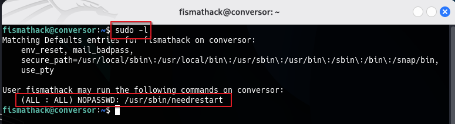
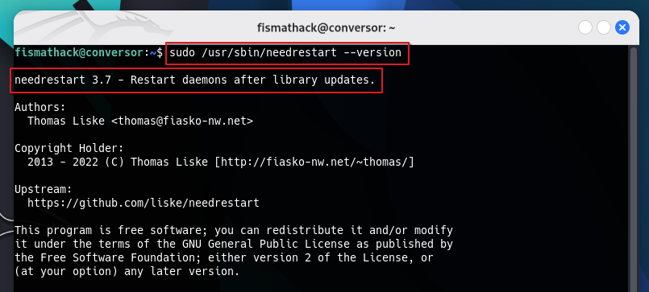
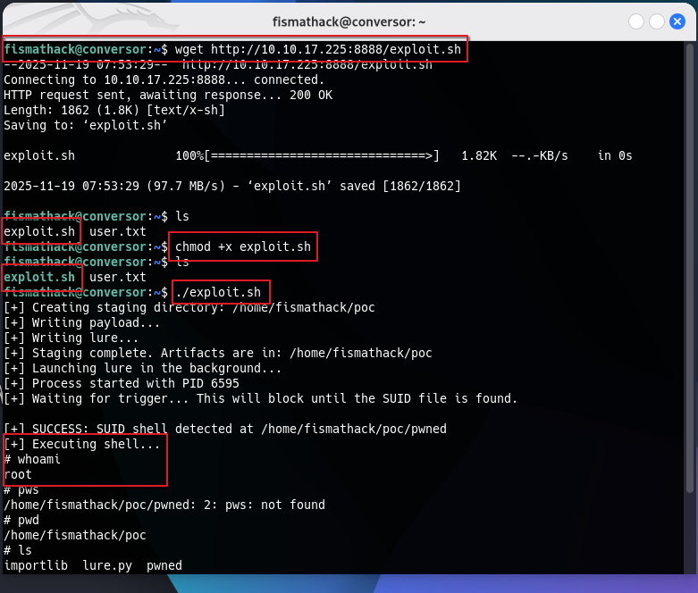
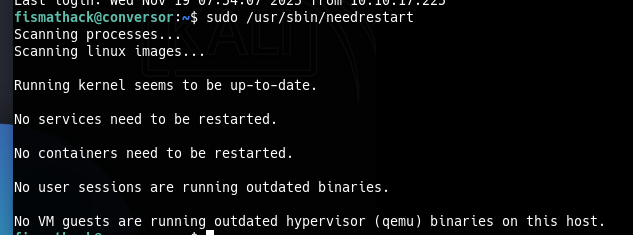
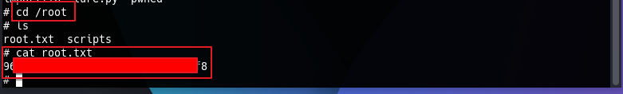
