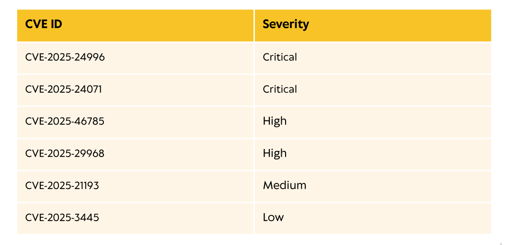
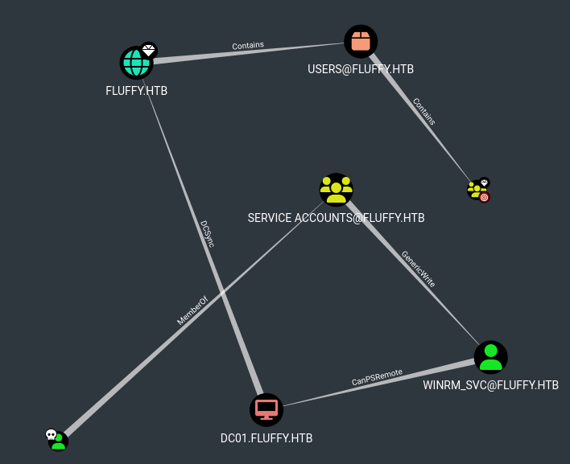

### [*] Machine Name ==> Fluffy
### [*] Difficulty ==> Easy
### [*] OS ==> Windows
### [*] Points ==> 20 

#

### [*] Machine Description
  * As is common in real life Windows pentests, you will start the Fluffy box with credentials for the following account: `j.fleischman / J0elTHEM4n1990!`

#

### [*] Summary:
  * This machine talks about vulnerable version of windows lead to leaked credentials, And misconfigured active directory lead to shadow credentials attack of any user in specified group and getting user flag, And vulnerable AD CS (Active Directory Certificate Service) lead to privilege escalation to administrator and getting root flag. 

#

### [*] Scanning:

  * Active Directory with Kerberos.
  * Domain Controllers `FLUFFY.HTB` & `DC01.FLUFFY.HTB`.
  * SMB is opened.

### [*] SMB Enumeration:
  * I used `smbmap` to know my permissions in SMB.

  * I have `READ, WRITE` permissions on `IT` directory.
  * Log in SMB using `smbclient` to enumerate the directory.

  * I found interesting PDF file `Upgrade_Notice.pdf`, I downloaded to discover what's inside.

### [*] PDF File Enumeration:
  * This file talks about high-impact CVEs publicly disclosed and Windows version that's running on this machine is vulnerable of them, And there's list of the CVEs inside the file.

  * After spending few time to understand these CVEs, I decided to use this CVE `CVE-2025-24071`.

### [*] Used CVE Explaination `CVE-2025-24071`:
  * Hackers can use this CVE on vulnerable versions of windows to leak the credentials of the victim.
  * It works when you inject vulnerability's payload inside file with this extension `.library-ms` and compress it inside `ZIP` file and put the `ZIP` file on machine, Once the victim opened or decompressed it, You'll receive his credentials `NTLMv2 Hash` on your server (listener).

### [*] Leaking Credentials Steps:
  * I used this script to make vulnerable `ZIP` file.

  * Put the file on the machine using SMB.

  * Wait for few time, Once the victim decompressed it, You'll receive his credentials `NTLMv2 Hash` on your listener (I used responder tool).

  * The victim's username is `p.agila`.
  * I cracked the hash with `john the ripper` and got a password.

### [*] Active Directory Map:
  * Once i have credentials, I used `bloodhound-python` to get active directory data and details to upload it into `BloodHound` and see mape of active directory.

  * I searched for username of our victim and put `Owning` mark on it.

  * I enumerated the shortest path to `DOMAIN ADMINS` group using owned credentials and enumerated the users of `DOMAIN ADMINS` group and users of `SERVICE ACCOUNTS` group.

  * When i was looking at reaching `DOMAIN ADMINS`'s map, I found that `SERVICE ACCOUNTS` group has `Generic Write` permission on `WINRM_SVC` user, I thought that maybe there's something useful on this user.

### Getting Access On `WINRM_SVC`:
  * First, I need to add myself to `SERVICE ACCOUNTS` group.
  * Perform shadow credentials attack to make another credential and get access on `WINRM_SVC` without knowing anyone.
  * And finally, Log in with shadow creds of this user by `evil-winrm`.

  * BOOM, We got user flag

### [*] Privilege Escalation For Getting Root:
  * When i was enumerating users of `SERVICE ACCOUNTS` group, I discovered a user that manage certificate authority service `CA_SVC`, I tried to make shadow credentials on this user too and it works well and got credentials.
  * I thought maybe there's vulnerability in CA "Certificate Authorities" of active directory.
  * When i scanned vulnerabilities with `CA_SVC` credentials, I found that CA is vulnerable to `ESC16`.

### [*] `ESC16` Vulnerability's Explaination:
  * This occures when security extension is disabled, This extension put Object's SIDs (Security Identifier) to make strong identity for users and services accounts, When it's disabled, Active Directory falls back to legacy mapping, typically using UPN (User Principle Name).
  * So hackers can manipulate UPN and get access on high-privilege users.

### [*] Steps To Exploit `ESC16` Vulnerability:
  * Change your victim's UPN to another user, `administrator` in this case.
  * Send request to get certificate as this user (administrator), You'll get administrator certificate.
  * Return UPN to the normal to avoid errors.
  * Request to get credentails by the certificate.
  * Log in as administrator with `evil-winrm`.

  * BOOM, We got root flag.