### Machine Name: Imagery
### Difficulty: Medium
### OS: Linux
### Points: 30

### [*] Scanning
- Once i got ip-address of the target, I started Nmap Scan.
- I found opened SSH and Web-Application with python backend.
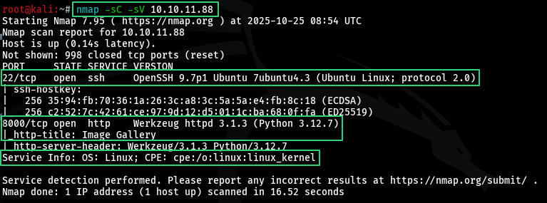

### [*] Website Enumeration and Testing.
- I registered an account and loggedin this website to test it's functionalities.
- When I was testing `Report Bug` function, I found that my report goes to admin page to analyze, So i views the source code of the website to see how does the developer render the user input in admin page, And i found out that the developer renders the 'Report Content' without fiteration, And This leads to XSS lead to steal admin cookie ---> ATO (Account Take Over).
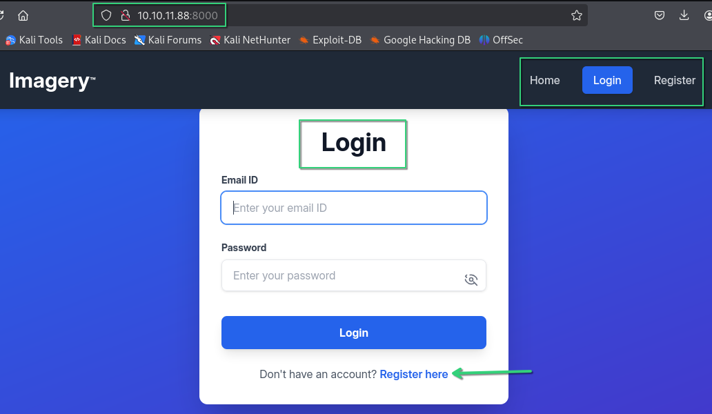
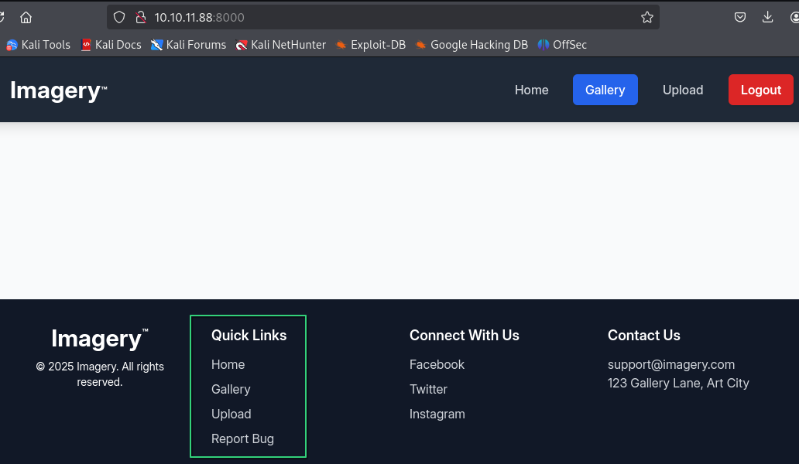
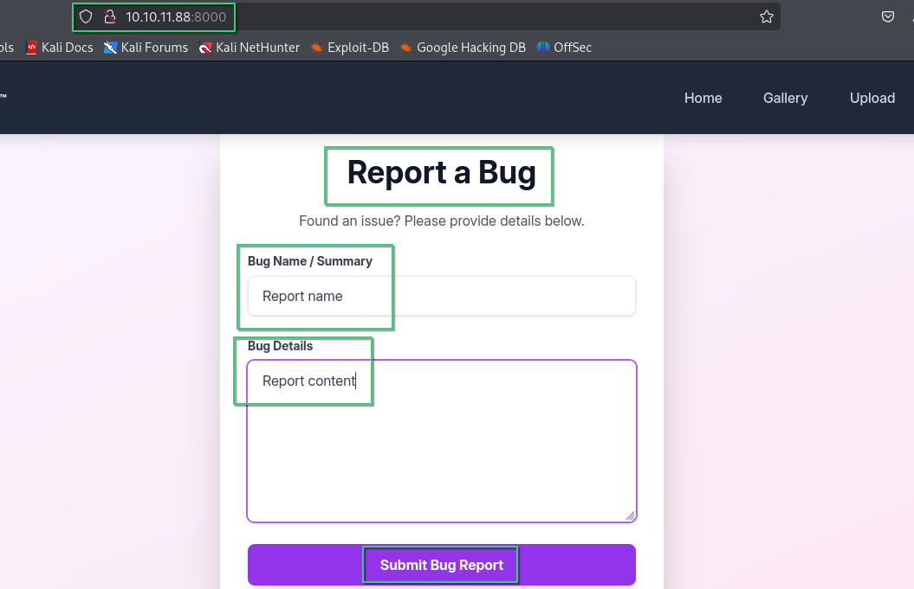
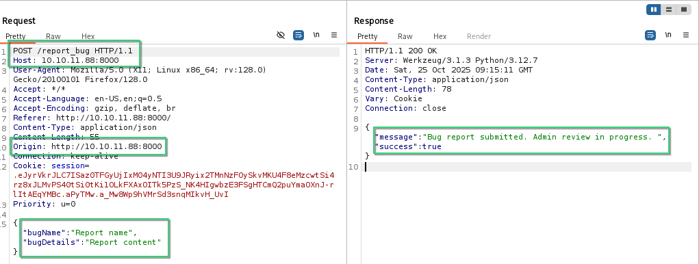
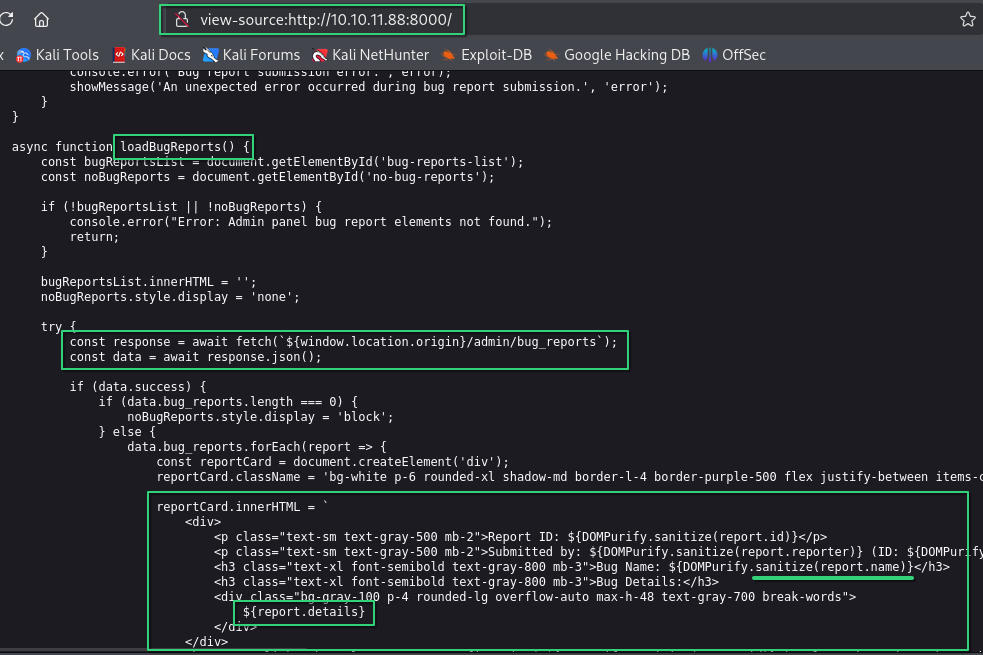
- I used netcat as a listener to recieve admin cookie.
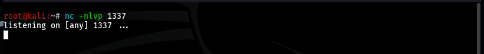
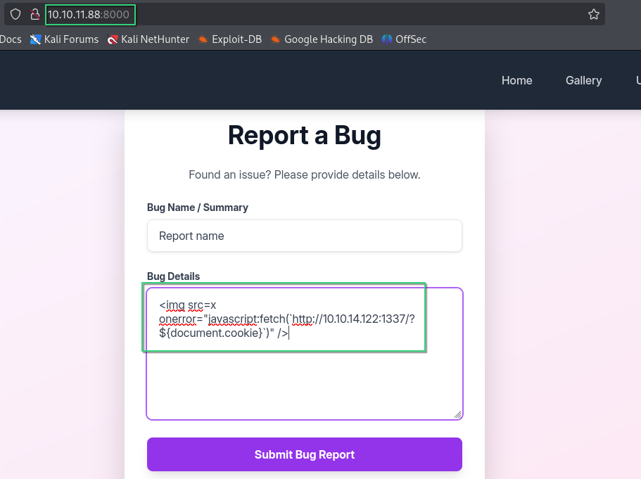
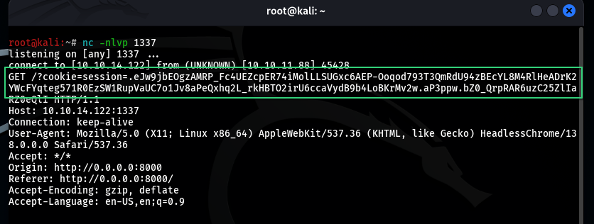
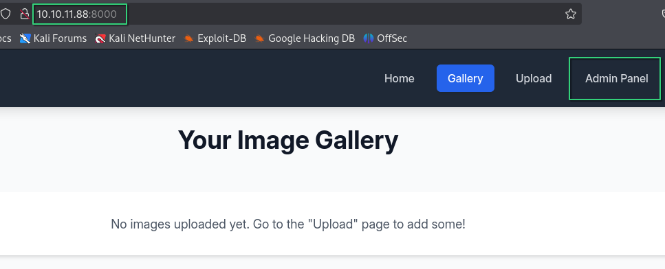

### [*] Chainedd Bugs Lead RCE (Remote Command Execution)
- Once i opened admin panel, I found two account (admin, testuser).
- When i was testing admin panel functionalities, i found "Download log" function.
- This function downloads log file of the user, So i tried to test LFI (Local File Inclusion) and read `/etc/passwd` file and it worked.
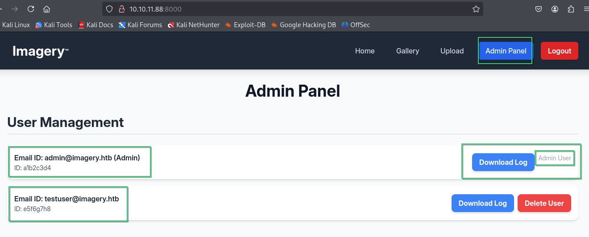
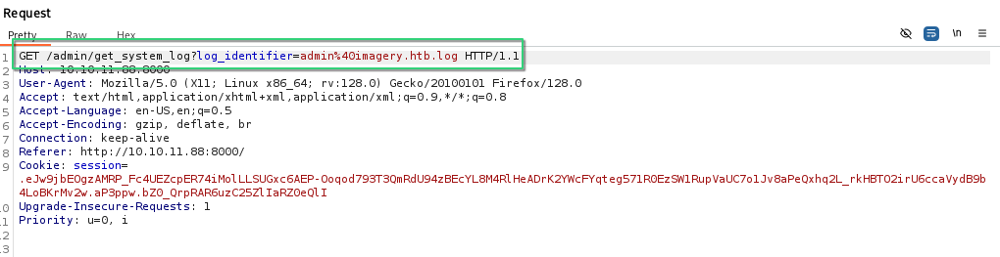
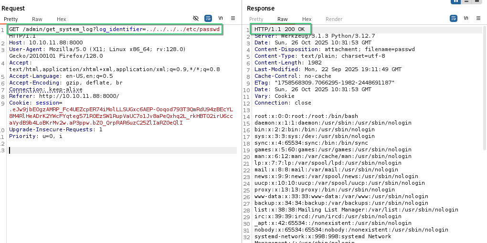
- Root directory was after four of `../`, So i will fuzz files after only one of `../` to in this path `/var/www/html/<FILE>`.
- In my case, there's no fuzzer worked well with, So i decided to build my own simple fuzzer to fuzz on python files, because the back-end of this website was built on python.
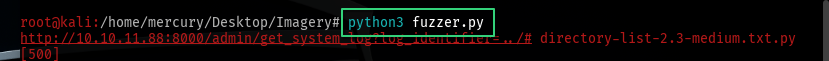
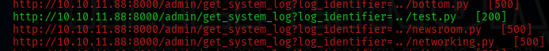
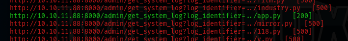
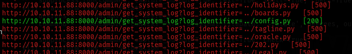
- The files i found took me to another files.
    - test.py (We got nothing from this file)
    - app.py ===> api_edit.py
    - config.py ===> db.json
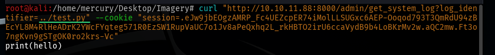

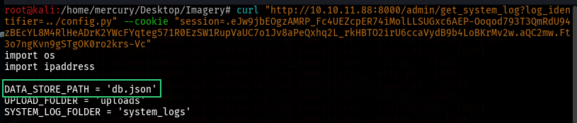
- All files we need are `api_edit.py` and `db.json`
- `db.json` files contained leaked credintials of `admin@imagery.htb` and `testuser@imagery.htb`.

- During Analyzing `api_edit.py` file, I found that we can execute command on the server via 'crop' option in "Image Transformation" function, Beacuase the back-end developer uses linux built-in tool called 'crop' to crop the image, and he gave this option `shell=True`, This will lead to RCE (Remote Command Execution).
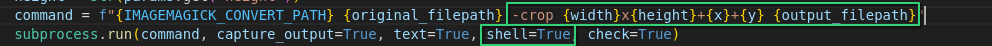
- I tried to access this function but it disabled on admin account, So i cracked `testuser@imagery.htb`'s password to login this account to access the "Image Transformation" function, And it worked well.

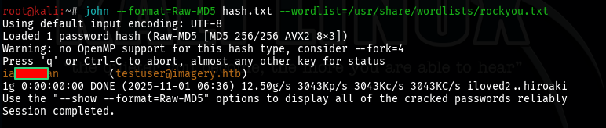
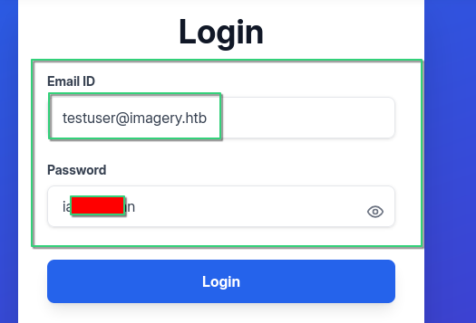
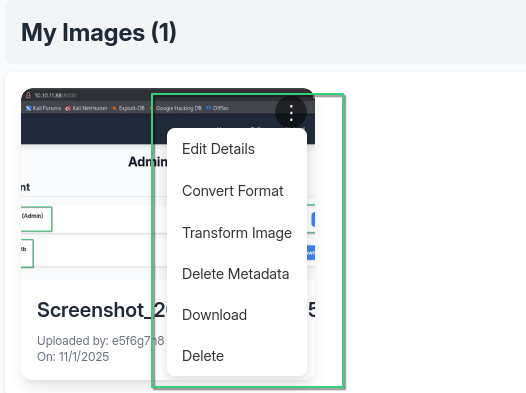
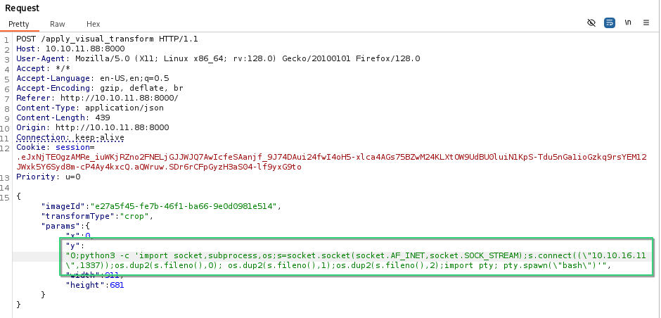
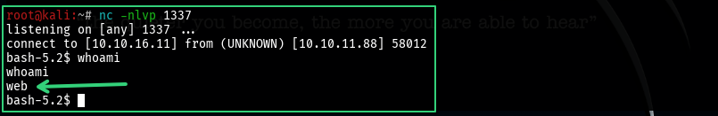

### [*] Privilege Escalation to user 'mark'
- During enumeration of the machine, I found encrypted file `web_20250806_120723.zip.aes` in `/var/backup`.
- After little bit research and some help from chatgpt, I found that this type of encryption usually used for protecting sensitive data, and also i need key to decrypt it.
- I moved the encrypted file to my attacker machine and used `pyAesDecrypt` to brute-force key of this file (https://github.com/BridgerAlderson/pyAesDecrypt).
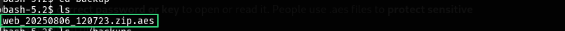
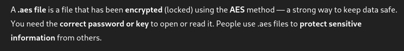
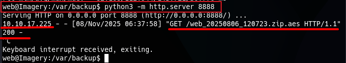
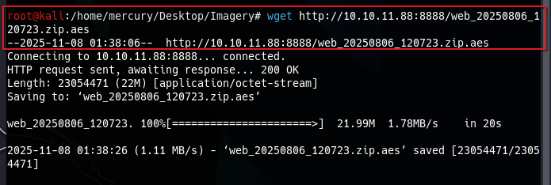
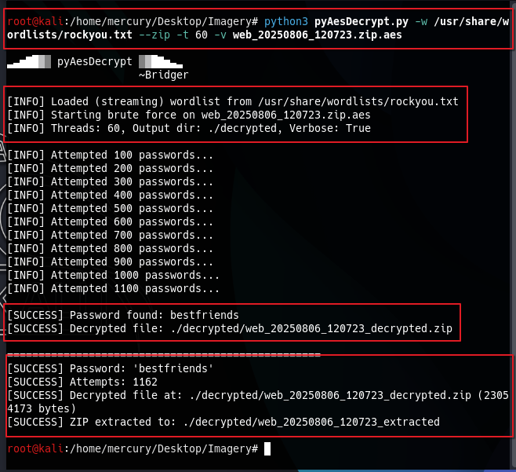
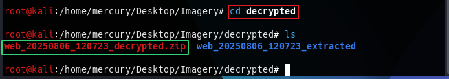
- I found other json file in this archive contains credintials of some users.
- The one we need is user 'mark'.
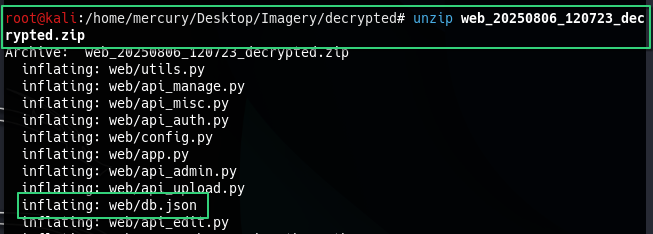
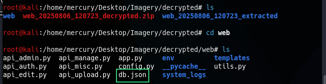
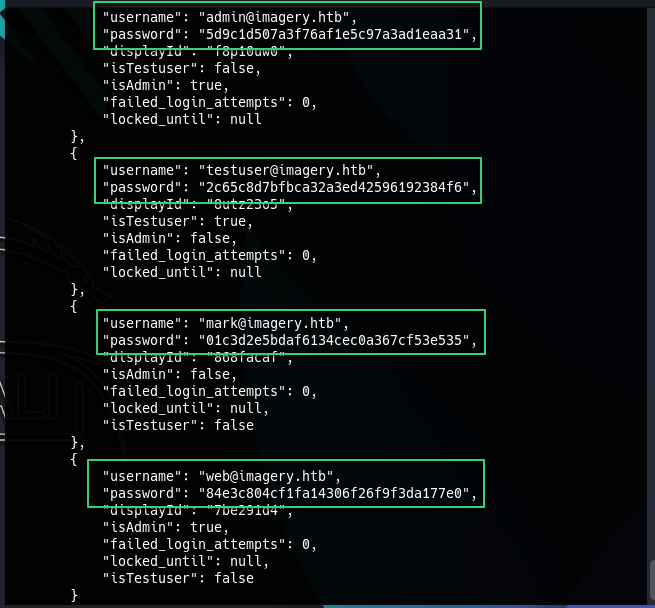
- I cracked his password, But i couldn't login with ssh, So i views the users who have access on shell from `/etc/passwd` and i found user 'mark',So i used this command to switch to mark user directly.
    - `su mark`
- I found 'user.txt' `User Flag`.
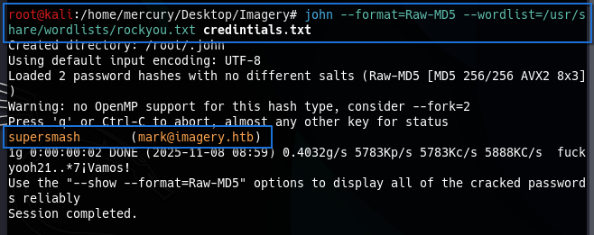
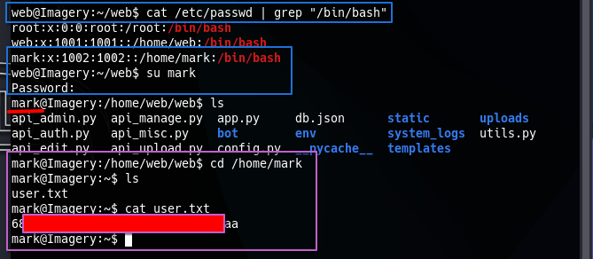

### [*] Privilege Escalation To Root User
- After i've got user flag, I used this command `sudo -l` to know what are tools that use sudo privileges (Run With Root Permissions), And i found custom tool called `charcol` in this path `/usr/local/bin/charcol`.
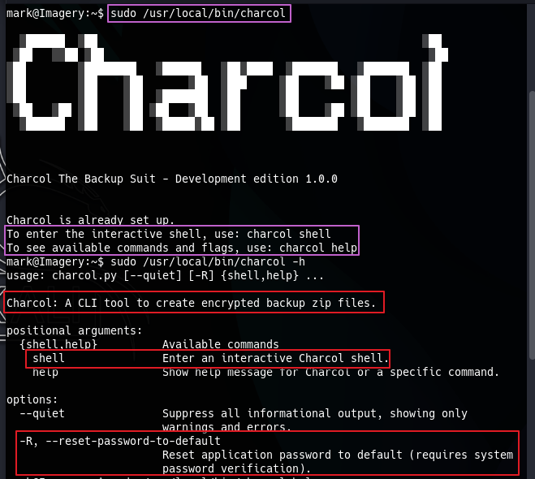
- When i was trying to understand this tool, I found that i can get interactive shell on this tool, And also i can make scheduled tasks.
- First, i run this tool in no-password mode.
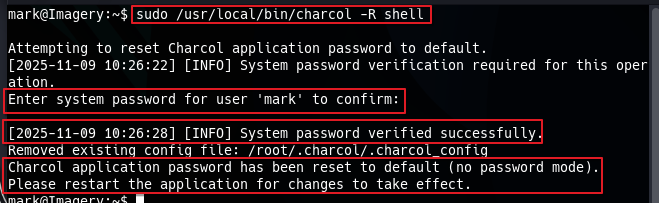
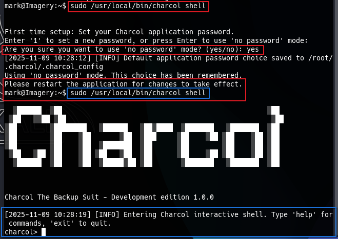
- After i got the shell, I typed 'help' to know how can i make scheduled tasks.
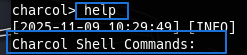
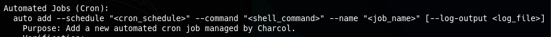
- I used this command to copy root.txt (Root Flag) to my directory.
    - `auto add --schedule "* * * * *" --command "cat /root/root.txt > /home/mark/.flag.txt" --name "Root Flag" --log-output /home/mark/.log.txt`
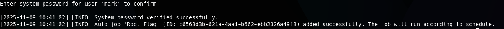
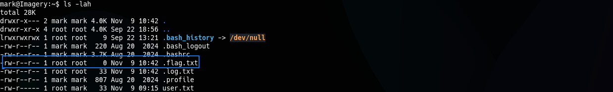
- You'll find root flag on `.flag.txt` or `.log.txt`, In my case i found it in `.log.txt` file.
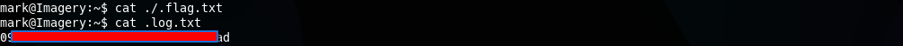
