- Machine Name: Outbound
- OS: Linux
- Difficulty: Easy
- Points Earned: 30

### Scanning
- After scanning the target with Nmap, I found SSH and HTTP server (website) (mail.outbound.htb).
- After visiting the website, I found login page, So i logged in with credintials that i got in machine description.
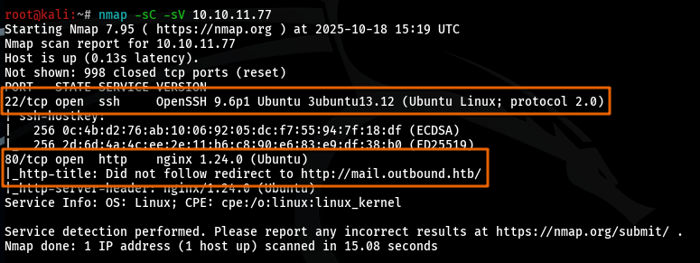
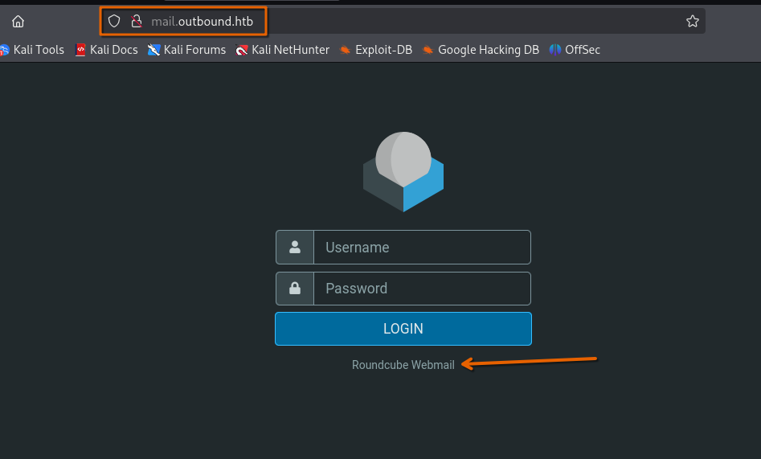
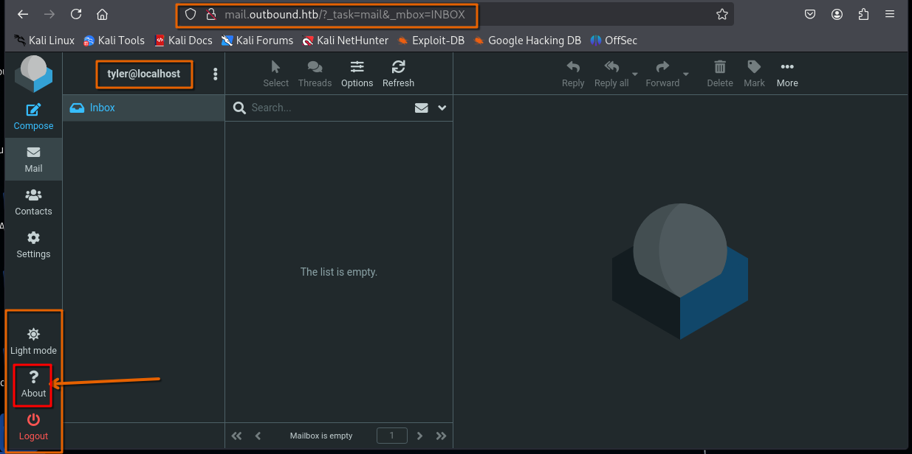

### Enumeration And Getting First Step Inside The Network
- This website is built on service called `Roundcube Webmail`.
- During web service enumeration, I found service's version `1.6.10`, So i was looking for CVEs to exploit this service. (CVE-2025-49113).
- This is the reference i used to exploit the CVE https://github.com/B1ack4sh/Blackash-CVE-2025-49113 .
- After executing this exploit, I got my first reverse-shell on web server.
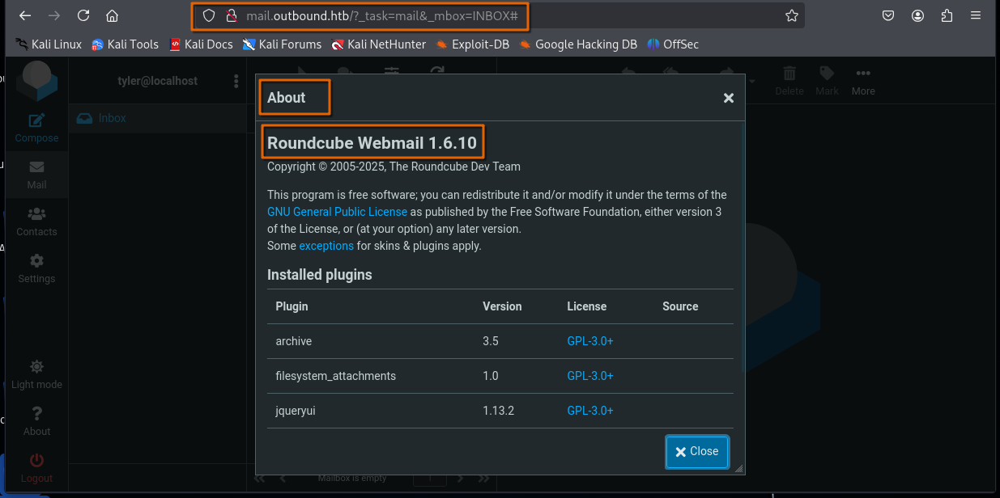
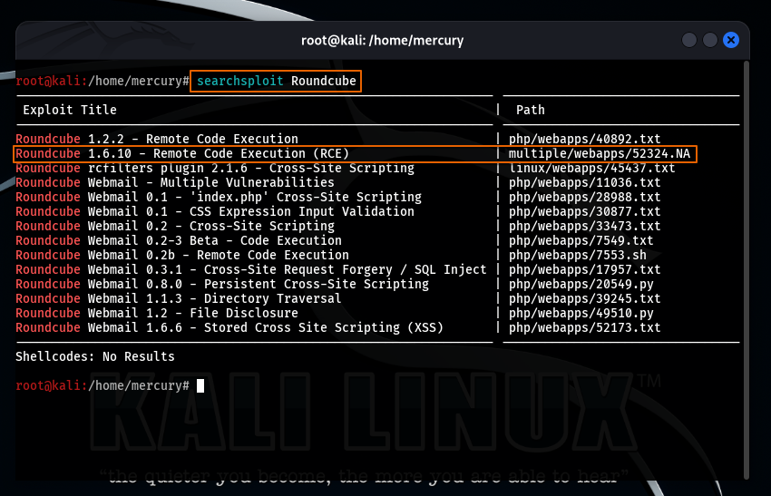
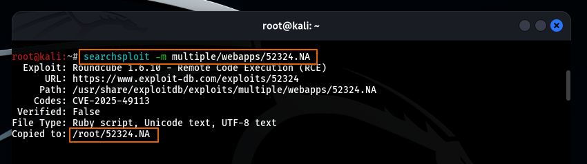
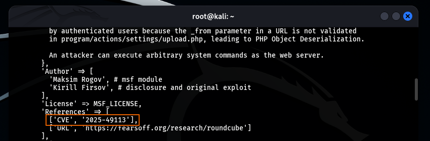
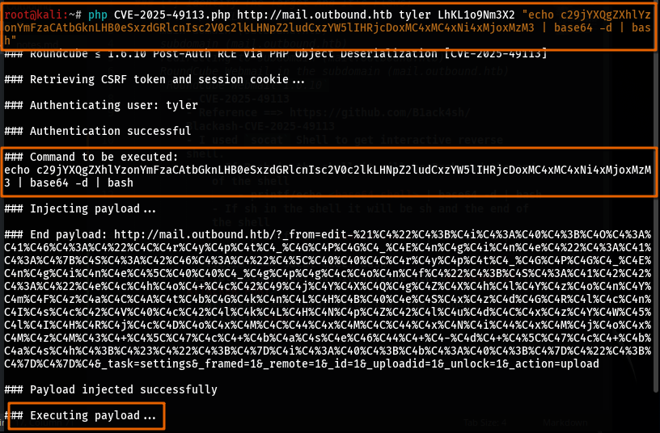
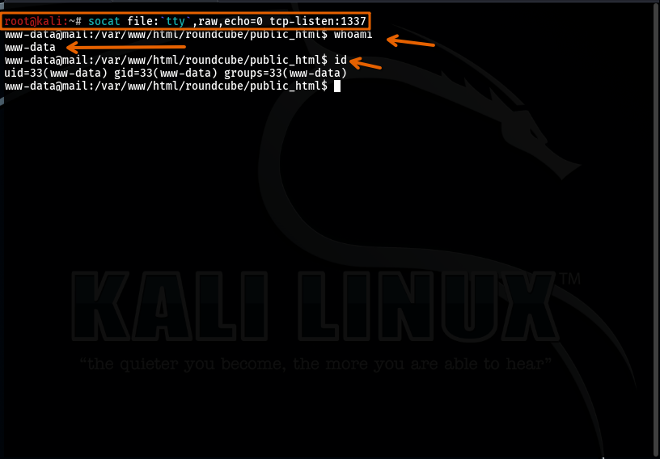

### Privilege Escalation To Gain User Flag
- I identified the users on this machine `cat /etc/passwd | grep '/bin/bash'`.
- During manual enumeration i found mysql database credintials in configuration file.
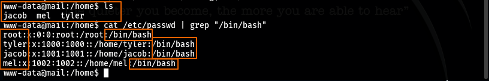
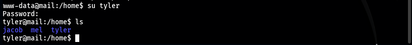
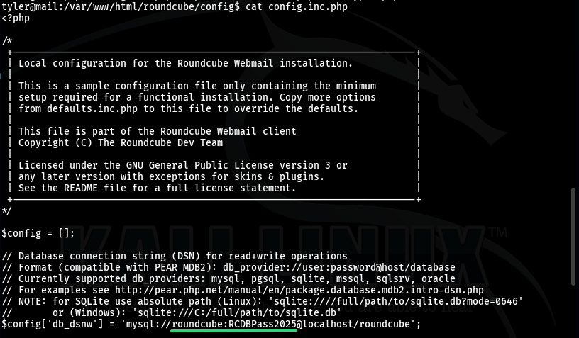
- After logging in MySQL database, I dumped session from sessions table in the database.
- decrypt the session via base64 decoder, And i found username `jacob` and his encrypted password.
- After some enumeration of the machine i found key of encryption type called `DES`, So i thought that this encryption of jacob's password.
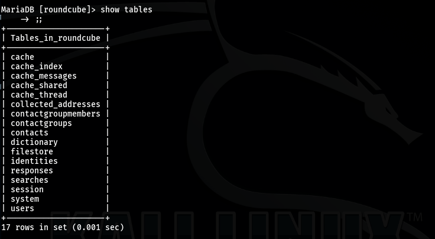

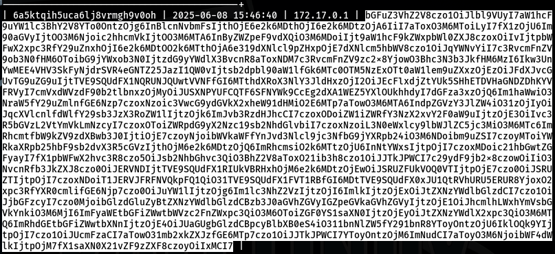
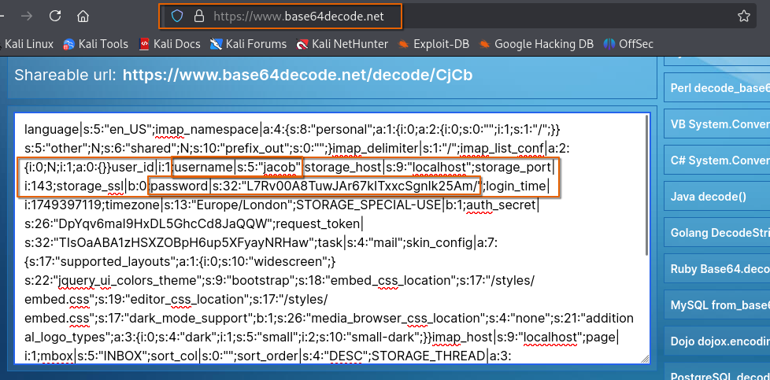

- NOTE: You need to make you research to know how to decrypt this type of encryption `DES` to understand the following steps.
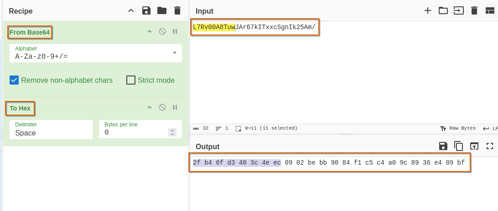
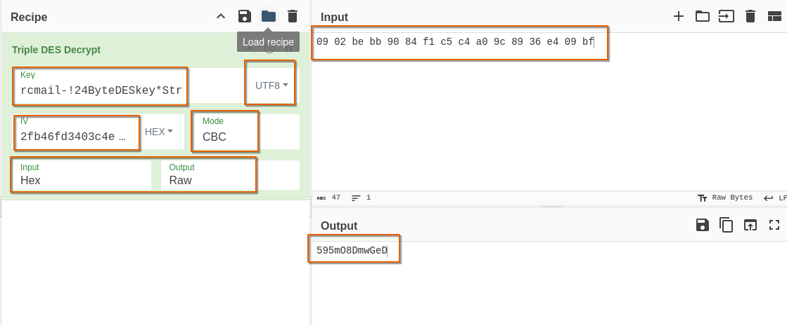
- Change user to jacob `su jacob`.
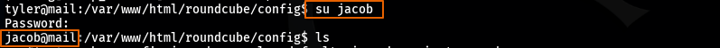
- I don't find user flag, So i enumerated this user and found his ssh password, And i got user flag.
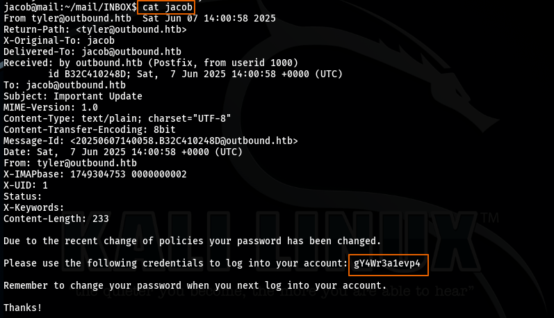
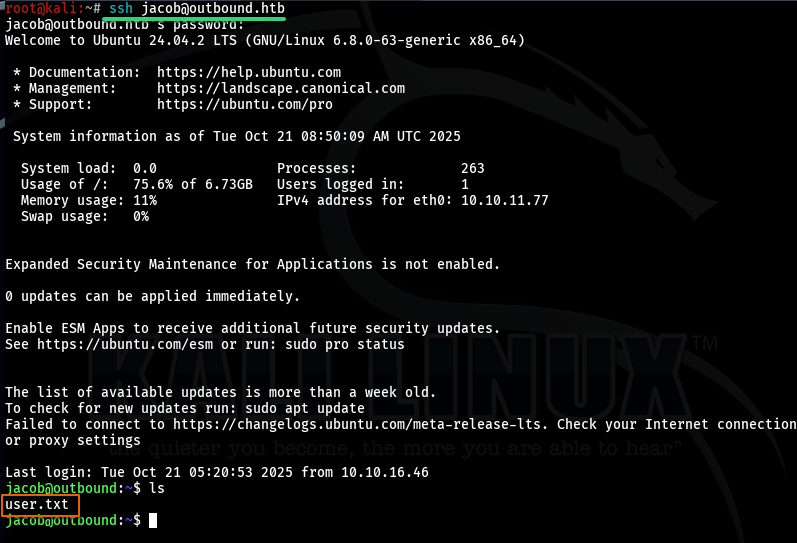

### Privilege Escalation To Gain Root Flag
- I run this command `sudo -l` to know what are the binaries that has root privileges.
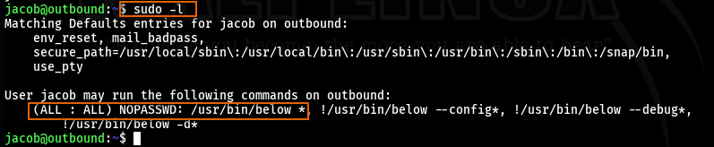
-  When below is run with sudo, it may log errors into a world-writable directory (/var/log/below), allowing attackers to symlink a log file to sensitive targets
1. Verify World-Writable log directory you should see `drwxrwxrwx 3 root root 4096 Jul 14 16:39 /var/log/below`
2. Remove any existing 'error\_root.log'
3. Create symlink to '/etc/passwd'
4. Create payload file this will add new root user attacker with no password `username:password:UID:GID:comment(home/full name):home\_directory:shell`
5. Trigger a log write as a root (this is the core of exploit) `sudo /usr/bin/below record`
6. Overwrite /etc/passwd via symlink
7. Become root
- I found script to automate this operation and gain root access.
https://github.com/dollarboysushil/Linux-Privilege-Escalation-CVE-2025-27591
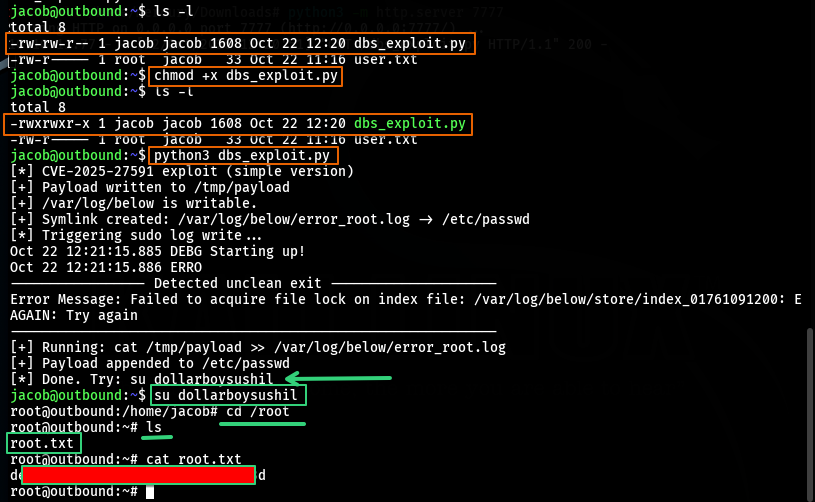
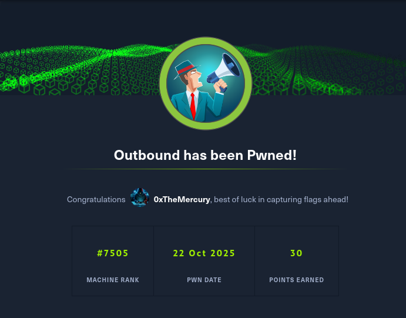