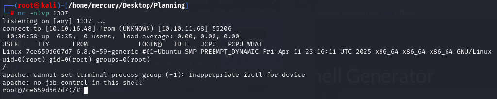

### Machine Name: Planning
### Difficulty: Easy
### Points: 20
### OS: Linux

### Machine Description 
  * As is common in real life pentests, you will start the Planning box with credentials for the following account: admin / 0D5oT70Fq13EvB5r

### Summary:
  * During the scanning i found the website, But i didn't find any interesting thing in enumeration of this site, So i performed subdomain enumeration and i discovered subdomain with vulnerable service running on it and this service will lead to RCE (Remote Command Execution) on the server, Then I got user.txt (User Flag) by logging in with SSH to higher privileged user via leaked credentials in environment variables, Then i got root access and root.txt (Root Flag) via internal service running on the machine.

### [*] Scanning
  * I found opened SSH and HTTP server (Website).
  * I tried to test and enumerate the website, But i didn't find any interesting thing in this site, So i decided to perform subdomain enumeration.

### Subdomain Enumeration
  * When i was performing subdomain enumeration, I got subdomain and when i was discovering this site, I found vulnerable service running on this site, And this vulnerability allow attackers execute commands on the operating system `CVE-2024-9264`.

### [*] Getting Reverse Shell Via CVE-2024-9264
  * I logged in with Given Credential in Machine Description.
  * Then Use CVE POC to get reverse shell on the server.
  * I tried many reverse shells but only `Perl PentestMonkey` reverse shell is the only one that worked well.

### [*] Privilege Escalation To User "enzo" (User Flag)
  * After getting reverse shell, I uploaded `linpeas.sh` script to find ways to gain access to higher privileged user.
  * After uploading linpeas, I discovered leaked credential of user `enzo` in environment variables, And I logged in to user `enzo` with these credentials and got user.txt (User Flag).

### Privilege Escalation To User "Root" (Root Flag)
  * When i was enumerating this machine manually, I found credentials of user called `root_grafana`, This looks user of service or something like that.
  * So i tried to look for internal service running on this machine, And i found it then forwarded the traffic to my attacker machine by this command `ssh -L <ATTACKER PORT>:127.0.0.1:<SERVICE PORT> enzo@<MACHINE IP>` to test this service.

  * This service manages scheduled tasks, So i copied the root terminal to tmp directory and make it run with root permissions.
    * I used this command `cp /bin/bash /tmp/bash && chmod u+s /tmp/bash`
    * Then save and run this task from the service, After that you'll find the the terminal inside you `/tmp` directory.
    * Just execute it and you'll get root terminal.

  * BOOOOM, We got flag.txt (Root Flag).