### Machine ==> Soulamte
### Points ==> 20
### Difficulty ==> Easy
### OS ==> Linux

### [*] Scanning
* I used Nmap to scan machine ip
* I found ssh and http (Website)

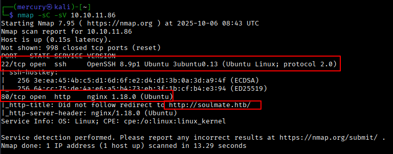

### [*] Website Enumeration
* I was trying to enumerate and test the main domain (soulmate.htb) but i got nothing, So i decided to enumerate subdomains and i got only one subdomain running ftp service (ftp.soulmate.htb)
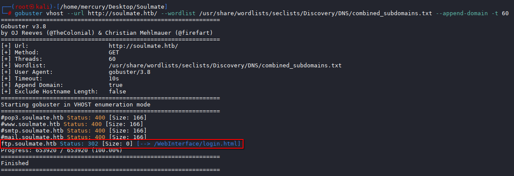

### [*] Exploiting The Vulnerable FTP Service On The Subdomain (ftp.soulmate.htb)
* When i was trying to understand what is that service `CrushFTP` and how does it work, I found vulnerability will make me create fake admin account and login as administrator `CVE-2025-2825`
* You'll find the script to exploit the vulnerability here ==> https://github.com/ghostsec420/ShatteredFTP
* This CVE will give credintials of the fake admin account to login as administrator.
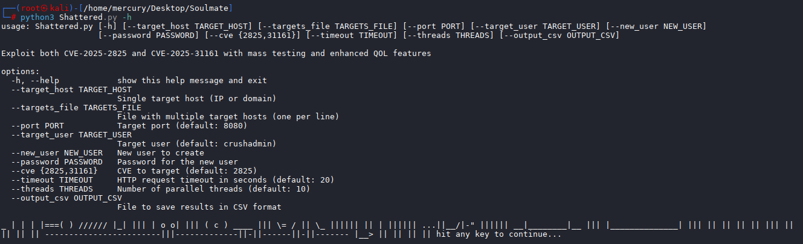
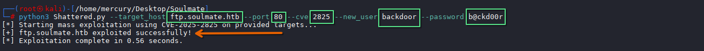
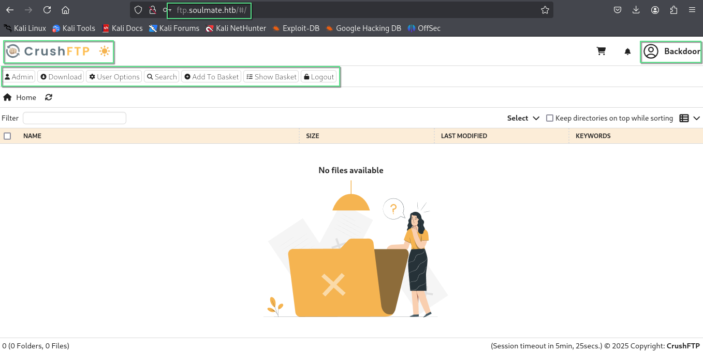

### [*] Logic Bug --> ATO (Account Take Over) --> File Upload --> RCE (Remote Command Execution)
* When i was trying to understand this service, I found that i can change another admin's password, And this will lead to ATO `Account Take Over` to another admin account, And i choosed ben account because this account have the files of web pages, So i can upload my file (PHP Reverse Shell) and request this file to gain a shell on my attacker machine.
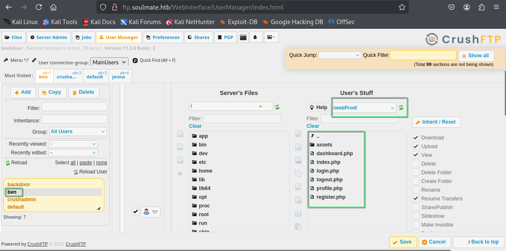
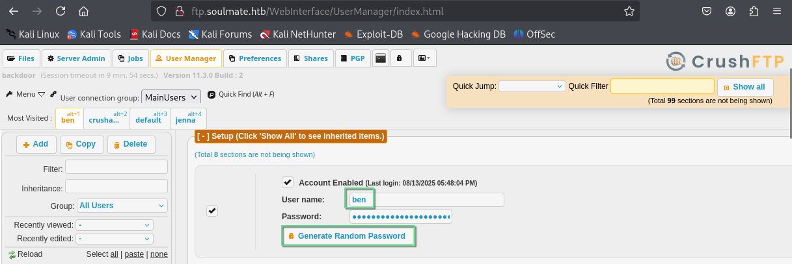
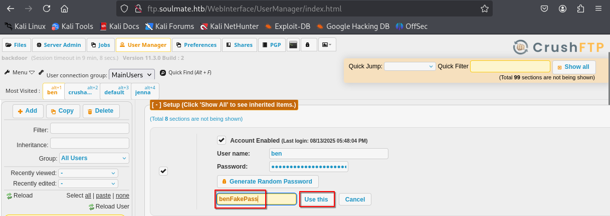
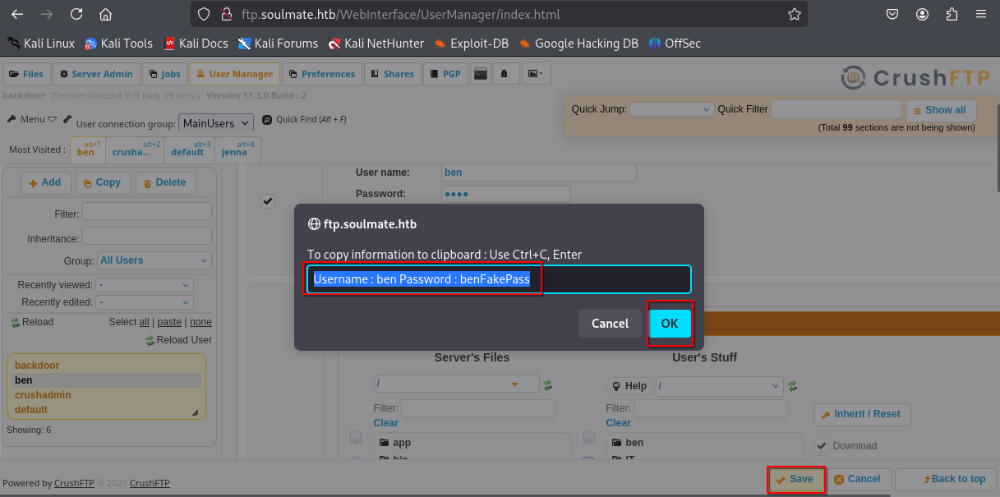
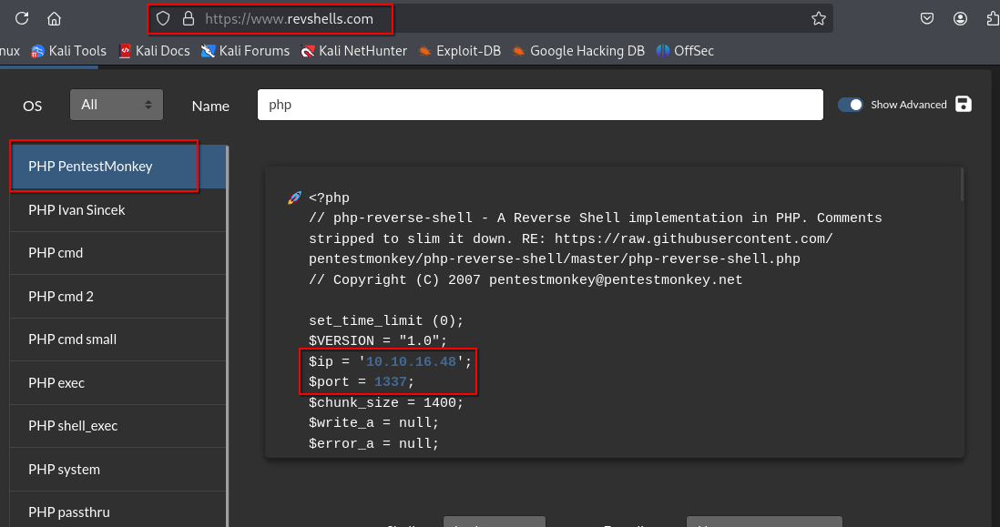
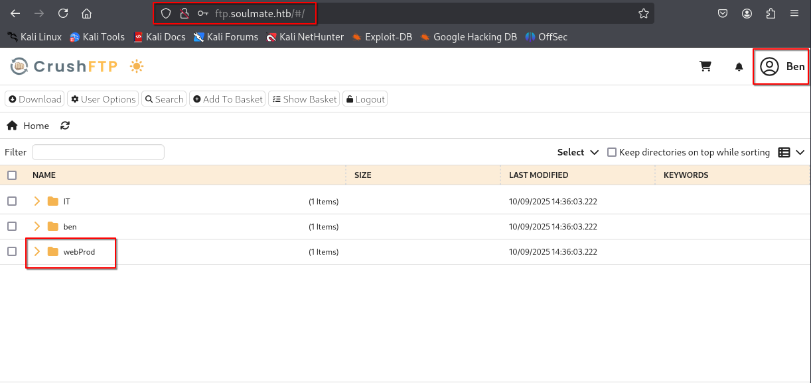
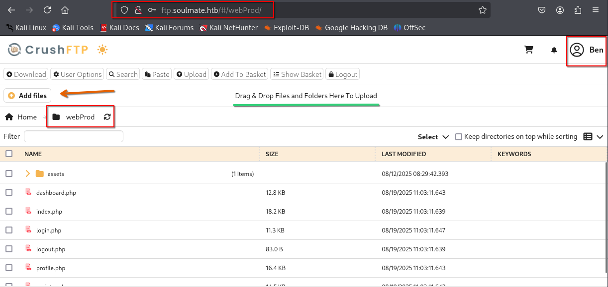
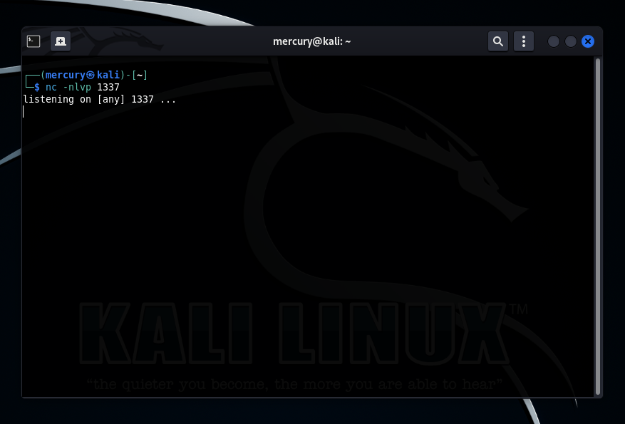
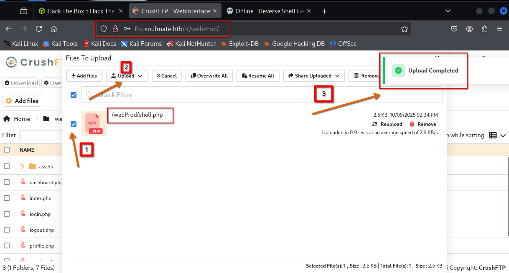
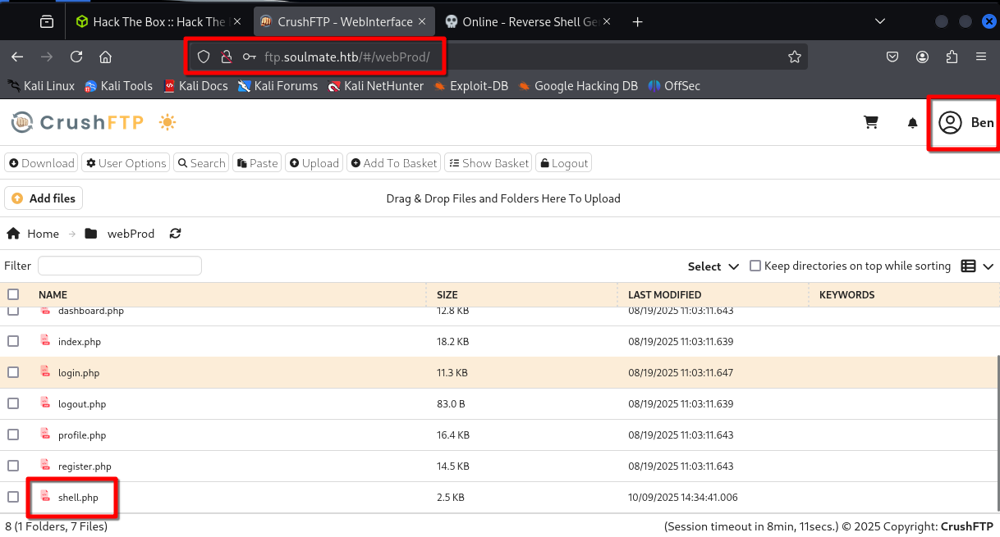
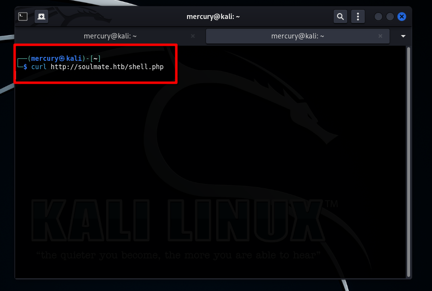
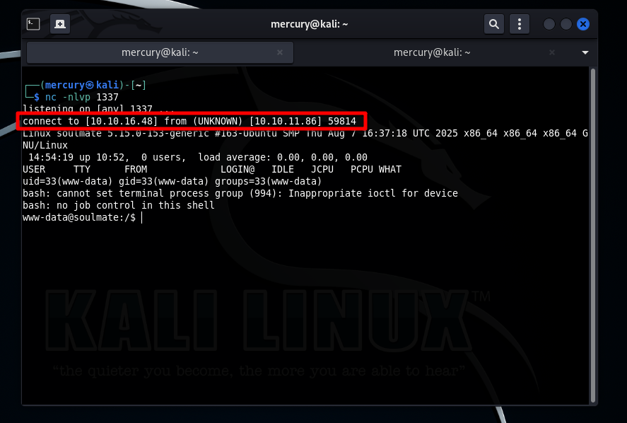

### [*] Leaked Credintials --> User Flag
* During machine enumeration, I found leaked credintials in the file `/usr/local/lib/erlang_login/start.escript`, I used these credintials to login to another user via SSH and i found `user.txt` file (User Flag)
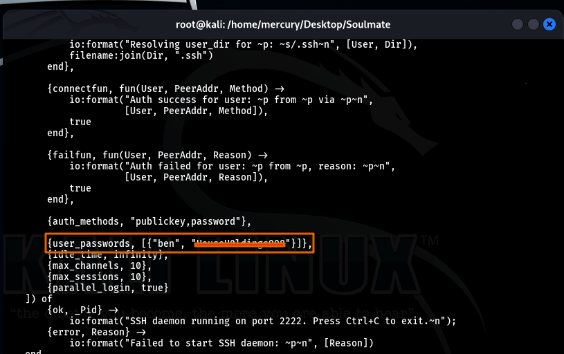
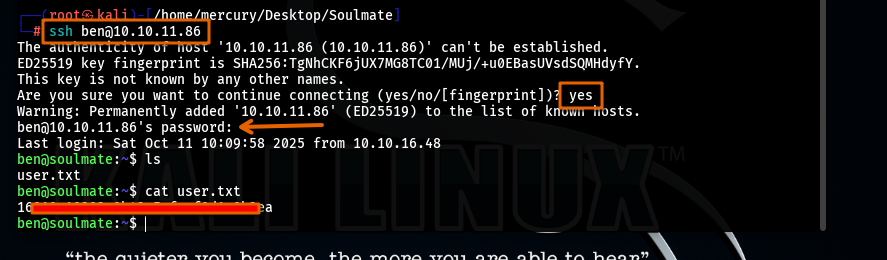

### [*] Internal Service --> Root Access
* I found another SSH service running internally on user `ben`, I tried to login on this service with ben credintials and it worked, Then i could use module inside this service to execute commands as root, So i extracted the content of the `root.txt` file (Root Flag)
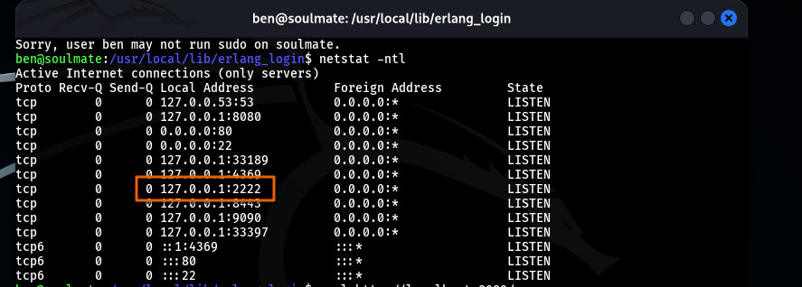
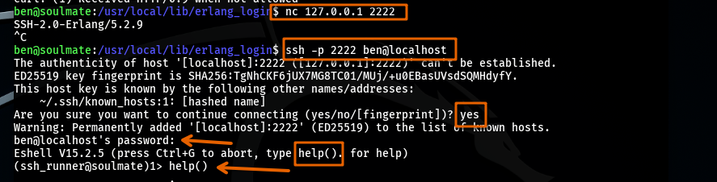
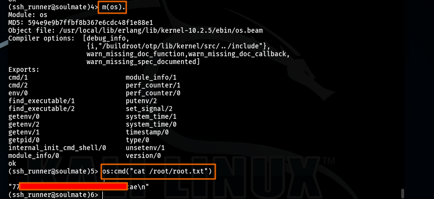

### [*] Summary
    ---------------
    -- Nmap Scan --
    ---------------
    |
    ------- Website (Soulmate.htb)
    |
    -----------------
    -- Enumeration --
    -----------------
    |
    ------- Subdomain (ftp.soulmate.htb)
    |
    ------------- CVE-2025-2825 --> Creating Fake Admin Account
    ------------- Logic Bug --> ATO (Account Take Over) --> File Upload --> RCE (Remote Command Execution)
    |
    -------------------------
    -- Machine Enumeration --
    -------------------------
    |
    ------- /usr/local/lib/erlang_login/start.escript 
    ------- Leaked Credintials (ben:HouseH0ldings998) --> SSH login as another user (User Flag)
    |
    ---------------------------------------
    -- Privilege Escalation To Root User --
    ---------------------------------------
    |
    ------- Internal SSH service on the machine running with root privileges
    ------- Extract content of root.txt file (Root Flag).